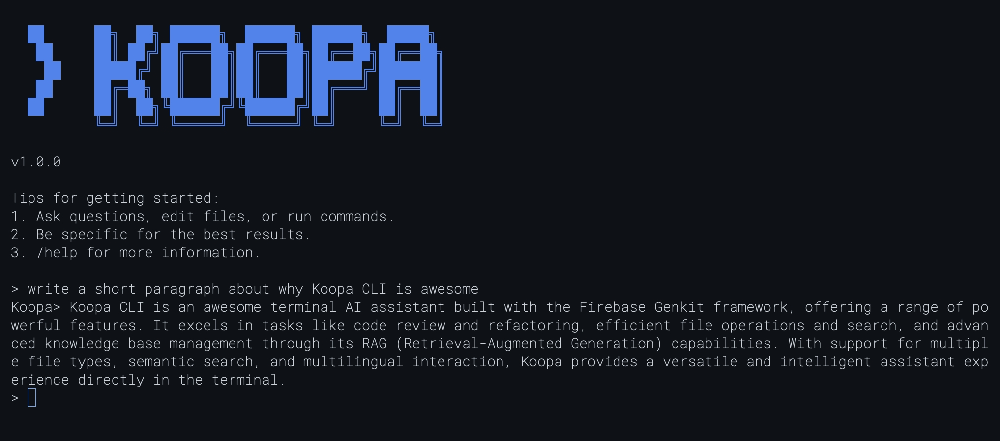

# Koopa CLI



**A terminal-based AI assistant with knowledge base capabilities, built on [Genkit](https://github.com/firebase/genkit).**

Koopa brings AI conversations directly to your command line with the ability to index and search your local documents for context-aware responses.

## Why Koopa?

- **Persistent Sessions** - Save and resume conversations anytime, organized by topic
- **Smart Knowledge Base** - Index your documents and let Koopa remember them for you
- **Private & Local** - Your data stays on your machine, stored in local PostgreSQL
- **Extensible Tools** - Built-in file operations, system commands, and HTTP requests
- **MCP Compatible** - Add custom tools via [Model Context Protocol](https://modelcontextprotocol.io/)
- **Single Binary** - Pure Go implementation, no runtime dependencies
- **Powered by Genkit** - Built on Firebase's [Genkit framework](https://github.com/firebase/genkit)

## Installation

**Prerequisites:** Go 1.24 +, Docker & Docker Compose, and a [Gemini API key](https://ai.google.dev/)

```bash
# Clone and setup
git clone https://github.com/koopa0/koopa-cli.git
cd koopa-cli

# Start database (auto-runs migrations)
docker-compose up -d

# Build and run
go build -o koopa
export GEMINI_API_KEY=your-api-key
./koopa
```

## Getting Started

### Basic Chat

```bash
$ ./koopa
Version: 1.0

> What is the capital of France?
Paris is the capital of France.

> /exit
```

### Knowledge Base (RAG)

Index your documents and ask questions about them:

```bash
> /rag add ~/Documents/notes/

> /rag list
Indexed Documents (3):
- meeting-notes.md (2KB)
- project-ideas.txt (1KB)
- research.md (5KB)

> What were the action items from my last meeting?
Based on your meeting notes, the action items were:
1. Follow up with the design team
2. Schedule Q2 planning session
3. Review the budget proposal
```

### Session Management

Organize conversations by topic and resume them anytime:

```bash
> /session new "Project Brainstorming"
✓ Created new session: Project Brainstorming
  Session ID: 8551638c-ba89-43c6-8fbf-e323c026bab9

> Let's brainstorm ideas for our Q2 product launch
[AI responds with ideas...]

> /session new "Bug Investigation"
✓ Created new session: Bug Investigation

> /session list
╔══════════════════════════════════════════════════════════╗
║  Sessions (2 most recent)                               ║
╚══════════════════════════════════════════════════════════╝

 ▶ 1. Bug Investigation  [ACTIVE]
    ID: c7a7f88d-a916-4cbb-8f7d-7f33d748ecec
    Messages: 0  |  Updated: 2025-11-17 14:33:51

   2. Project Brainstorming
    ID: 8551638c-ba89-43c6-8fbf-e323c026bab9
    Messages: 5  |  Updated: 2025-11-17 14:30:15

> /session switch 8551638c-ba89-43c6-8fbf-e323c026bab9
✓ Switched to session: Project Brainstorming
  Conversation history loaded (5 messages)

> Continue with the brainstorming ideas
[AI continues from where you left off...]
```

## Features

### Interactive Chat

Start conversations with Gemini right from your terminal:

```bash
> Tell me a joke about programming
> Explain how binary search works
> Help me debug this error message
```

### Knowledge Base (RAG)

Index your local documents and have Koopa reference them in conversations:

```bash
> /rag add ~/Documents/         # Index a directory
> /rag add ./project/README.md  # Index a single file
> /rag list                     # View all indexed content
> /rag status                   # Check system status
```

### Session Management

Save and restore your conversations across sessions:

```bash
> /session new "My Project Planning"  # Create a new session
> /session list                       # View all your sessions
> /session switch <id>                # Switch between sessions
> /session                            # Show current session details
> /session delete <id>                # Delete a session
```

Your conversation history is automatically saved to PostgreSQL, allowing you to:

- **Resume conversations** - Pick up exactly where you left off
- **Organize by topic** - Create separate sessions for different projects
- **Search history** - Access past conversations anytime
- **Never lose context** - All messages are persisted to the database

### Built-in Tools

Koopa can help you with:

- **File Operations** - Read, write, and manipulate files
- **System Commands** - Execute shell commands
- **Network Requests** - Make HTTP requests and fetch web content

### Human-in-the-Loop Safety

Koopa automatically asks for your confirmation before executing potentially dangerous operations:

```bash
> Delete all node_modules directories

Analyzing request...

[CONFIRMATION REQUIRED]
Tool: executeCommand
Command: find . -name 'node_modules' -type d -exec rm -rf {} +
Reason: This command will delete all node_modules directories recursively.
        This operation cannot be undone.

Approve? [y/n]: y

✓ Executing command...
✓ Deleted 3 directories, freed 450MB
```

**Safety features:**

- **Automatic danger detection** - Operations like file deletion, `rm -rf`, `DROP DATABASE`, or writing to system paths (`/etc/`, `/usr/`) automatically trigger confirmation prompts
- **Clear explanations** - See exactly what will happen and why it needs approval before execution
- **Dynamic escalation** - Even normally safe operations become dangerous based on context (e.g., writing to `/etc/hosts`)
- **User control** - You have final say on all destructive operations; rejected actions are gracefully handled

This safety mechanism is built on Genkit's interrupt system and ensures you never accidentally execute dangerous commands.

### Extensible via MCP

Add custom tools using the [Model Context Protocol](https://modelcontextprotocol.io/) to extend Koopa's capabilities.

## Commands

| Command                  | Description                           |
| ------------------------ | ------------------------------------- |
| `/help`                  | Show available commands               |
| `/version`               | Show version information              |
| **Session Management**   |                                       |
| `/session`               | Show current session details          |
| `/session list [limit]`  | List all sessions (default: 10)       |
| `/session new <title>`   | Create a new session with a title     |
| `/session switch <id>`   | Switch to a different session         |
| `/session delete <id>`   | Delete a session and all its messages |
| **Knowledge Base (RAG)** |                                       |
| `/rag add <path>`        | Index files or directories            |
| `/rag list`              | List indexed documents                |
| `/rag remove <id>`       | Remove document from knowledge base   |
| `/rag status`            | Show RAG status and statistics        |
| **Conversation**         |                                       |
| `/clear`                 | Clear current conversation            |
| `/exit` or `/quit`       | Exit Koopa                            |

**Shortcuts:**

- `Ctrl+D` - Exit Koopa
- `Ctrl+C` - Cancel current input

## Configuration

Koopa works with minimal configuration. Set your API key and you're ready to go:

```bash
export GEMINI_API_KEY=your-api-key
./koopa
```

For advanced settings, create `~/.koopa/config.yaml`:

```yaml
# AI model
model_name: "gemini-2.5-flash" # or "gemini-2.5-pro"
temperature: 0.7
max_tokens: 2048

# Database (using docker-compose defaults)
postgres_host: "localhost"
postgres_port: 5432
postgres_user: "koopa"
postgres_password: "koopa_dev_password"
postgres_db_name: "koopa"

# Knowledge base
rag_top_k: 3 # Number of relevant documents to retrieve
embedder_model: "text-embedding-004" # Google AI embedder

# Conversation
max_history_messages: 50 # Keep recent 50 messages
```

## Technology

Koopa is built with:

- **[Genkit](https://firebase.google.com/docs/genkit/go)** - AI framework for tool integration
- **PostgreSQL + pgvector** - Vector storage for semantic search
- **Pure Go** - Single static binary, no runtime dependencies

## Contributing

Contributions are welcome! Please feel free to submit a Pull Request or open an issue on [GitHub](https://github.com/koopa0/koopa-cli).

## License

MIT License - see [LICENSE](LICENSE) for details.

---

**Built using [Genkit](https://github.com/firebase/genkit)**
