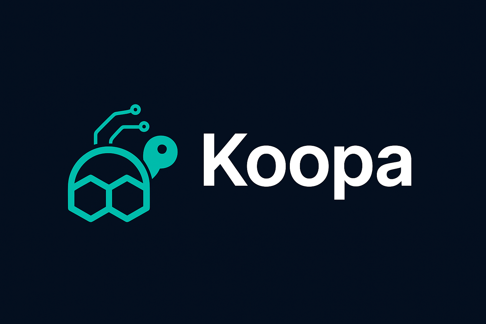

[Koopa](https://github.com/koopa0/koopa) is a powerful terminal-based AI assistant built on [Genkit](https://github.com/firebase/genkit), enabling you to interact with AI directly from your command line with RAG (Retrieval-Augmented Generation) support.

## Why Koopa?

Koopa brings professional AI capabilities to your terminal with a focus on simplicity, performance, and developer experience. Built with a streamlined architecture featuring PostgreSQL-backed RAG, Wire dependency injection, and a clean interactive mode.

## Key Features

<table>
  <tr>
    <td><strong>Pure Go Architecture</strong></td>
    <td>100% pure Go implementation with zero CGO dependencies. Single static binary for easy distribution and deployment. No need for C compilers or external dependencies. Cross-compile to Linux/Windows/macOS/ARM with one command.</td>
  </tr>
  <tr>
    <td><strong>Interactive Chat Mode</strong></td>
    <td>Default interactive mode - just run <code>./koopa</code> to start chatting. Streaming responses with real-time typewriter effect. Persistent session management with PostgreSQL. Built-in slash commands for system control (<code>/help</code>, <code>/version</code>, <code>/clear</code>, <code>/exit</code>).</td>
  </tr>
  <tr>
    <td><strong>RAG-Powered Knowledge</strong></td>
    <td>PostgreSQL + pgvector for stable vector storage. Local file indexing with 20+ supported file types. Semantic search with Google's text-embedding-004. Manual control via <code>/rag</code> commands for transparency.</td>
  </tr>
  <tr>
    <td><strong>Genkit Integration</strong></td>
    <td>Full integration with Firebase Genkit framework. 9 built-in tools with security validation (file, system, network operations). MCP (Model Context Protocol) support for connecting external tool servers. OpenTelemetry integration for observability.</td>
  </tr>
  <tr>
    <td><strong>Clean Architecture</strong></td>
    <td>Wire dependency injection for compile-time safety. Modular design with clear separation of concerns. No global state, thread-safe components. Security-first with comprehensive validation.</td>
  </tr>
  <tr>
    <td><strong>Developer-Friendly</strong></td>
    <td>Simple command-line interface without subcommands. Environment variable configuration (<code>GEMINI_API_KEY</code>). Optional YAML configuration for persistent settings. Pure English UI with AI auto-detecting response language.</td>
  </tr>
</table>

## How Does It Work?

Koopa leverages the Genkit framework with PostgreSQL-backed RAG to provide an intelligent AI experience directly in your terminal. It manages conversation context, retrieves relevant knowledge from your indexed files, and executes tool calls securely.

Key capabilities:

- **Streaming Chat**: Real-time typewriter effect with smart punctuation pauses
- **RAG Retrieval**: Semantic search over indexed local files (20+ file types supported)
- **Tool Execution**: Securely execute file operations, system commands, and HTTP requests
- **Session Management**: Persistent conversation history in PostgreSQL
- **Local File Indexing**: Index and search your documents, code, and notes
- **Extensible**: Add custom tools using Genkit's framework and connect external tool servers via MCP

## Quick Start

### Prerequisites

- Go 1.23 or higher
- PostgreSQL 14+ with pgvector extension
- Gemini API Key ([Get one free](https://ai.google.dev/))

### Installation

```bash
# 1. Clone the repository
git clone https://github.com/koopa0/koopa.git
cd koopa

# 2. Set up PostgreSQL with pgvector
createdb koopa
psql koopa -c "CREATE EXTENSION IF NOT EXISTS vector;"

# 3. Build (100% pure Go, no CGO)
go build -o koopa

# 4. Set your API key
export GEMINI_API_KEY=your-gemini-api-key

# 5. Start chatting!
./koopa
```

## Usage

### Interactive Mode (Default)

Simply run `koopa` to enter interactive mode:

```bash
$ ./koopa

╔══════════════════════════════════════════════════════════╗
║  Koopa v1.0                                               ║
║  AI Personal Assistant powered by Gemini                 ║
║                                                          ║
║  Type /help for commands, Ctrl+D to exit                 ║
╚══════════════════════════════════════════════════════════╝

Session ID: abc123...

You> Hello! What can you help me with?
Koopa> Hello! I'm Koopa, your AI assistant. I can help you with...

You> /rag status
╔══════════════════════════════════════════════════════════╗
║  RAG Status                                              ║
╚══════════════════════════════════════════════════════════╝

  Database:       Connected ✓
  Embedder:       text-embedding-004 ✓
  Indexed Docs:   15 files

You> /exit
Goodbye!
```

### Slash Commands

Available commands in interactive mode:

**System:**

- `/help` - Show all available commands
- `/version` - Show version information
- `/clear` - Clear conversation history
- `/exit`, `/quit` - Exit Koopa

**RAG (Knowledge Management):**

- `/rag add <path>` - Index a file or directory
- `/rag list` - List all indexed documents
- `/rag remove <doc_id>` - Remove a document from index
- `/rag status` - Show RAG system status

**Shortcuts:**

- `Ctrl+C` - Cancel current input
- `Ctrl+D` - Exit (same as `/exit`)

### RAG (Retrieval-Augmented Generation)

Koopa includes powerful RAG capabilities backed by PostgreSQL + pgvector:

```bash
# Check RAG system status
You> /rag status

# Index a single file
You> /rag add /tmp/notes.md

# Index a directory (recursive)
You> /rag add ~/Documents/notes/

# List all indexed documents
You> /rag list

# Ask questions about indexed content
You> What are my Muay Thai training routines?
Koopa> [AI retrieves relevant documents and answers based on your knowledge base]
```

**Supported File Types (20+):**
.txt, .md, .go, .py, .js, .ts, .java, .c, .cpp, .h, .hpp, .rs, .rb, .php, .sh, .yaml, .yml, .json, .xml, .html, .css, .sql

### Using Genkit Developer UI

You can inspect and debug Koopa using the Genkit Developer UI:

```bash
# Start Genkit Developer UI
genkit start -- go run main.go

# Access the UI at http://localhost:4000
# View tool executions, traces, and model interactions
```

## Configuration

### Environment Variables (Recommended)

```bash
# Required
export GEMINI_API_KEY=your-api-key-here

# Optional
export KOOPA_MODEL_NAME=gemini-2.5-flash    # Default model
export KOOPA_TEMPERATURE=0.7                # Response creativity
export KOOPA_MAX_TOKENS=2048                # Max response length
```

### Configuration File (Optional)

Create `~/.koopa/config.yaml`:

```yaml
# AI model settings
model_name: "gemini-2.5-flash"
temperature: 0.7
max_tokens: 2048

# Conversation history
max_history_messages: 50

# PostgreSQL configuration
postgres_host: "localhost"
postgres_port: 5432
postgres_user: "postgres"
postgres_db_name: "koopa"
postgres_ssl_mode: "disable"

# RAG configuration
rag_top_k: 3 # Number of documents to retrieve
embedder_model: "text-embedding-004" # Google embedding model
```

### Database Setup

Koopa requires PostgreSQL with pgvector:

```bash
# Install PostgreSQL (example for macOS)
brew install postgresql@14
brew services start postgresql@14

# Install pgvector
brew install pgvector

# Create database and enable extension
createdb koopa
psql koopa -c "CREATE EXTENSION IF NOT EXISTS vector;"
```

## Available Tools

Koopa comes with 9 built-in tools with security validation:

**File Operations:**

1. **readFile** - Read file contents with path validation
2. **writeFile** - Write content to file with safety checks
3. **listFiles** - List directory contents
4. **deleteFile** - Delete files with confirmation
5. **getFileInfo** - Get file metadata

**System Operations:**

6. **currentTime** - Get current system time
7. **executeCommand** - Execute system commands (with dangerous command blocking)
8. **getEnv** - Read environment variables (with sensitive variable protection)

**Network Operations:**

9. **httpGet** - Make HTTP GET requests (with SSRF protection)

All tools include comprehensive security validation to protect your system. You can extend Koopa with custom tools via MCP (Model Context Protocol).

## Architecture

Koopa uses a clean, modular architecture:

```
koopa/
├── cmd/                    # CLI commands
│   ├── interactive.go      # Interactive chat mode
│   ├── ask.go             # One-shot ask mode
│   └── ...                # Other commands
├── internal/
│   ├── app/               # Application container (Wire DI)
│   ├── agent/             # AI agent with Genkit
│   │   ├── tools/         # Genkit tools (file, system, network)
│   │   └── mcp/           # MCP server integration
│   ├── config/            # Configuration management
│   ├── knowledge/         # RAG knowledge store (pgvector)
│   ├── rag/               # RAG indexer & retriever
│   ├── security/          # Security validators
│   ├── session/           # Session management
│   └── sqlc/              # Generated database code
├── db/                    # Database schema & queries
│   ├── migrations/        # SQL migrations
│   └── queries/           # SQL queries (sqlc)
├── prompts/               # Genkit Dotprompt files
└── main.go               # Entry point
```

Key design principles:

- **Wire DI**: Compile-time dependency injection
- **No Global State**: All dependencies explicitly passed
- **Security First**: Comprehensive validation on all operations
- **RAG-First**: Knowledge retrieval always enabled
- **Session Isolation**: Each session has isolated context

## Documentation

For detailed documentation:

- [Genkit Official Documentation](https://firebase.google.com/docs/genkit/go)
- [MCP Protocol Specification](https://modelcontextprotocol.io/)

## Development

### Building from Source

```bash
# Build for current platform
go build -o koopa

# Build for Linux AMD64
GOOS=linux GOARCH=amd64 go build -o koopa-linux-amd64

# Build for Windows
GOOS=windows GOARCH=amd64 go build -o koopa-windows.exe

# Build for macOS ARM64 (Apple Silicon)
GOOS=darwin GOARCH=arm64 go build -o koopa-darwin-arm64
```

### Running Tests

```bash
# Run all tests
go test ./...

# Run tests with coverage
go test -cover ./...

# Run specific package tests
go test ./internal/agent/
```

### Regenerating Wire Code

If you modify dependency injection:

```bash
cd internal/app
wire
```

## Contributing

Contributions are welcome! Please feel free to submit issues and pull requests.

## License

MIT License - see [LICENSE](LICENSE) file for details.

## Contact

Have questions or suggestions? Feel free to open an issue on GitHub.

---

**Made with [Genkit](https://github.com/firebase/genkit)**
