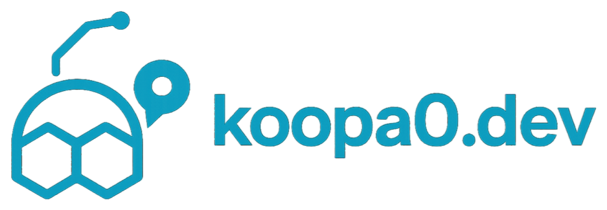
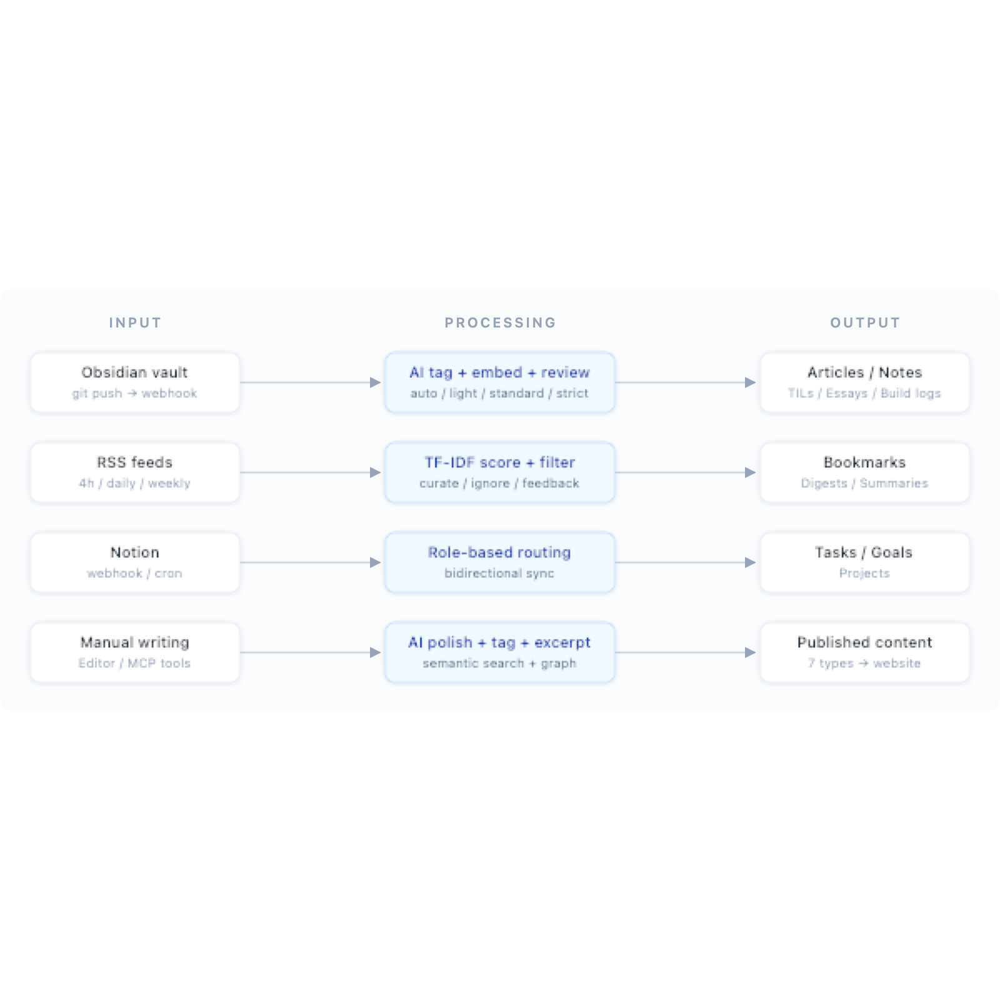
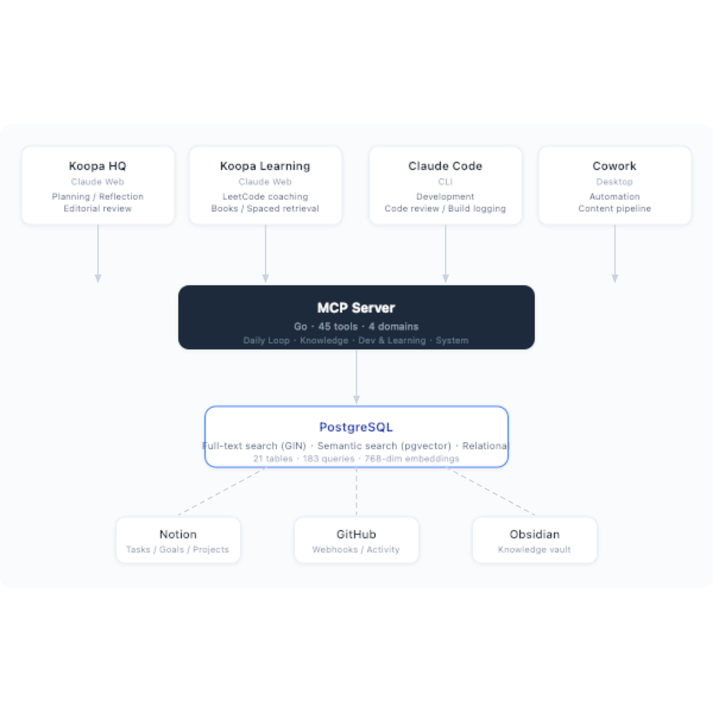
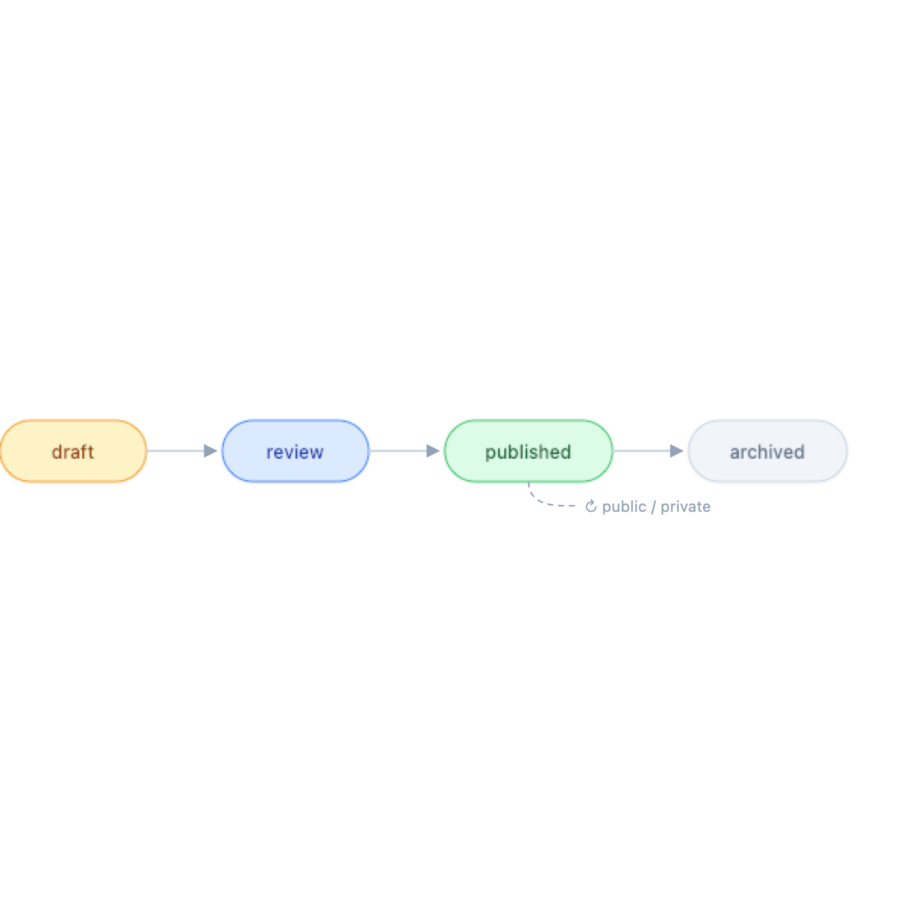

  

  <strong>English</strong> | <a href="README.zh-TW.md">繁體中文</a>

A Go backend that turns Notion, Obsidian, and RSS into a unified system — where AI operates as a first-class user through 45 MCP tools.

Not a blog platform. Not another PKM app. This is personal infrastructure — the same system I use every day to plan tasks, track learning, collect and curate articles, and publish what's worth sharing. Multiple AI environments (Claude Web, Claude Code, Cowork) connect to the same Go server and PostgreSQL, coordinating through structured artifacts instead of starting every conversation from scratch.

  

---

## Why this exists

I manage a lot of moving parts every day — tasks, learning goals, technical reading, Obsidian notes, articles to write. The volume kept growing, and I needed a system that could keep up, not just a collection of apps.

Notion and Obsidian are good at what they do. I still use both — Notion for task and goal management, Obsidian for technical notes. But the workflows I wanted didn't exist inside any single tool: cross-source semantic search across everything I've written, AI-driven daily planning loops, automated content pipelines that go from RSS feed to curated bookmark, hypothesis tracking that validates itself over time. The data was scattered across tools that couldn't talk to each other, and stitching them together manually didn't scale.

So I built the layer that sits underneath. A Go server with PostgreSQL that integrates these tools as data sources, runs 13 AI flows through Genkit, and exposes 45 MCP tools for AI to operate the entire system. Notion syncs tasks and goals bidirectionally. Obsidian syncs notes with vector embeddings for semantic search. RSS feeds get TF-IDF scored and surfaced for review. Everything flows into one database, and AI helps run the loop — plan, execute, reflect, adjust.

A side effect of this architecture: when multiple AI environments connect to the same backend, the "every session starts from zero" problem disappears. Claude Web plans my day, Claude Code picks up the tasks, Cowork runs the content pipeline — they all read and write the same data. No context is lost between sessions.

  

---

## Architecture

The system has three layers, four AI consumers, and three data flows.

### Three layers

**Notion + Obsidian** are the input layer — tools I already use, now connected as data sources rather than standalone silos. Notion provides tasks, goals, and projects via webhook and cron sync. Obsidian provides technical notes via git push and GitHub webhook. Neither is replaced; both gain a backend that can do things they can't do alone.

**PostgreSQL** is the processing layer — one database that holds everything. Full-text search via tsvector + GIN, semantic search via pgvector + HNSW, and Reciprocal Rank Fusion to merge the results. This is where raw material becomes queryable, searchable, and connectable.

**Go server + Angular frontend** is the output layer — an MCP server that exposes 45 tools for AI environments, a Genkit pipeline that runs 13 AI flows, and an Angular SSR frontend that publishes the finished product to the web.

### Four AI consumers

Each connects to the same MCP server but pulls different data subsets via the `sections` parameter:

| Consumer              | Role                                                | Typical tools                                                      |
| --------------------- | --------------------------------------------------- | ------------------------------------------------------------------ |
| Claude Web (Daily)    | Morning planning, evening reflection, weekly review | `get_morning_context`, `save_session_note`, `batch_my_day`         |
| Claude Web (Learning) | Study sessions, knowledge search, reading           | `log_learning_session`, `search_knowledge`, `read_oreilly_chapter` |
| Claude Code           | Development, build logging, project tracking        | `get_project_context`, `log_dev_session`, `search_tasks`           |
| Cowork                | Content pipeline, RSS management, system ops        | `create_content`, `publish_content`, `trigger_pipeline`            |

### Three data flows

**Obsidian → Website**: vault → git push → GitHub webhook → `notes` table → AI tags + embeddings → curate → `contents` table → publish → website.

**RSS → Website**: feeds → scheduled fetch → TF-IDF scoring → `collected_data` table → admin review: curate (→ bookmark) / ignore / feedback (→ improve scoring). Each feed has filter config (deny paths, title patterns, tag filters).

**Notion → System**: workspace → webhook / cron → route by role: `task` → tasks table, `goal` → goals table, `project` → projects table. Bidirectional — complete a task in the frontend, backend writes back to Notion.

---

## Core Concepts

Six concepts cover 80% of the system.

### Content — the finished product

Anything published to the website is a content record. Seven types share one table and one lifecycle: `article` (in-depth technical writing), `essay` (personal/non-technical), `build-log` (project development records), `til` (Today I Learned), `note` (technical snippets), `bookmark` (curated external article + commentary), `digest` (weekly/monthly roundup).

  

Lifecycle: **draft** → **review** → **published**. Content = something you'd put your name on and let others see.

### Notes — two different things

This is the easiest thing to confuse. **Obsidian notes** live in the `notes` table — raw material, admin-only, hundreds to thousands of them, carrying vector embeddings for semantic search. **Content-type `note`** lives in the `contents` table — polished technical snippets, published to the site, maybe dozens. Relationship: Obsidian note (raw) → decide it's worth sharing → polish → content (finished) → publish.

### Topic & Tag — knowledge organization

**Topics** are high-level domains (Go, System Design, AI) — 10-20, manually managed. **Tags** are fine-grained labels (pgvector, error-handling) — auto-extracted from Obsidian notes. Tags have an alias system that maps variants to canonical forms (`golang` → `go`, `JS` → `javascript`). Unknown raw tags create unmapped aliases for admin to map, confirm, or reject.

### Session Note — AI's work journal

Auto-generated by AI flows, not written by the user, not public. Five types: `plan` (daily), `reflection` (weekly), `context` (end of session), `metrics` (periodic data snapshot), `insight` (hypothesis record — see below).

### Insight — hypothesis tracking

A session note with hypothesis → validation structure. AI spots a pattern, records it with a falsification condition, and the system tracks evidence over time until the hypothesis is verified, invalidated, or archived. Example: "90% of articles with relevance score < 0.3 get ignored" → gather evidence across sessions → confirmed → adjust threshold.

### Project — your work

Projects have their own table with case study fields (problem / solution / architecture / results) — the project page reads like a portfolio, not a list. Projects link to content records (build-logs, articles) and tasks, and sync from Notion or are created manually.

---

## MCP Design

MCP (Model Context Protocol) is how AI environments interact with the system. 45 tools across four domains.

### Four domains

| Domain                  | Tools | Purpose                                                                   |
| ----------------------- | ----- | ------------------------------------------------------------------------- |
| Daily Loop              | 11    | Plan → Execute → Reflect → Adjust. The daily work cycle                   |
| Knowledge & Content     | 13    | Search, create, curate, publish. Content lifecycle + O'Reilly integration |
| Development & Learning  | 8     | Build logs, learning records, weakness analysis, project tracking         |
| System & Infrastructure | 13    | Monitoring, RSS management, goal tracking, insight lifecycle              |

Full tool reference with parameters and risk levels: [`docs/MCP-TOOLS-REFERENCE.md`](docs/MCP-TOOLS-REFERENCE.md)

### Design principles

| Principle                            | What it means                                                                                             |
| ------------------------------------ | --------------------------------------------------------------------------------------------------------- |
| One tool, one action, one risk level | No multiplexer patterns (`manage_X(action=...)`). The tool name IS the intent                             |
| No AI-calls-AI                       | If the consumer is already an LLM, don't route through another LLM on the server                          |
| Schema enforcement                   | Session notes have required metadata — insights must have hypothesis + falsification condition            |
| Freeze aggregate views at 4          | morning / reflection / delta / weekly are convenience packs. New features add surgical tools only         |
| Convergence before expansion         | Before adding a tool: "How many sessions degraded because this didn't exist?" 0 → backlog, 3+ → build now |
| Description quality > tool count     | 45 well-described tools beat 25 ambiguous ones                                                            |

### Composition examples

These tools are building blocks — you compose them into workflows that fit your needs:

- **Morning**: `get_morning_context` → review insights → decide plan → `save_session_note(type=plan)` → `batch_my_day`
- **Mid-development**: spot an issue → `create_task` + `save_session_note(type=context)`
- **Evening**: `get_reflection_context` → validate hypotheses → `update_insight` → `save_session_note(type=metrics)`
- **Learning**: `get_retrieval_queue` → practice recall → `log_retrieval_attempt(rating)` → FSRS schedules next review automatically
- **Knowledge work**: `search_knowledge` (4-way parallel: content full-text + Obsidian text + Obsidian semantic + dedup, ranked by RRF) → `synthesize_topic` → `create_content`

### Key technical details

**Search is 4-way parallel**: content full-text search + Obsidian text search + Obsidian semantic search (pgvector embeddings) + dedup. Results ranked by Reciprocal Rank Fusion.

**`get_morning_context` supports `sections`**: different AI environments pull different data subsets. Claude Code only needs tasks + plan + build_logs (~1/4 of the data). This prevents token waste.

**Learning uses FSRS for spaced retrieval**: when you review a TIL, the system records your recall quality (1–4) and computes the next review date using a forgetting curve model. Cards are created lazily on first review — no manual setup. The queue prioritizes overdue cards first, then surfaces never-reviewed TILs from the past week.

**Learning uses controlled vocabulary**: 35+ standardized tags (two-pointers, sliding-window, dp...) + result tags (ac-independent, ac-with-hints...) + weakness tags (weakness:xxx). Standardization prevents query fragmentation.

---

## AI Pipeline

13 Genkit flows, all using Claude. Every execution is recorded in `flow_runs` — monitorable and retryable.

**Content processing**: polish writing, auto-tag, generate excerpts, grammar check, quality scoring, strategic advice, bookmark extraction, build log structuring.

**Periodic reports**: morning brief (daily plan), daily dev log, weekly review, digest generation (weekly/monthly roundup).

**Project tracking**: analyze recent activity, update project status automatically.

---

## Tech Stack

| Layer        | Technology                                             |
| ------------ | ------------------------------------------------------ |
| Backend      | Go 1.26+, net/http (stdlib routing)                    |
| Database     | PostgreSQL, pgx/v5, sqlc                               |
| Search       | tsvector + GIN (full-text), pgvector + HNSW (semantic) |
| AI Pipeline  | Genkit Go (13 flows), Claude                           |
| Messaging    | NATS (Core + JetStream)                                |
| Cache        | Ristretto (in-memory)                                  |
| Frontend     | Angular 21, Tailwind CSS v4, SSR                       |
| Storage      | Cloudflare R2                                          |
| Integrations | Notion API, GitHub Webhook, Obsidian vault             |
| Protocol     | MCP (Model Context Protocol)                           |

---

## License

This repository contains personal content and infrastructure. All rights reserved.
