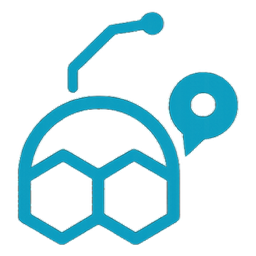

# koopa0.dev

<p align="center">
  
</p>

A personal operating system powered by AI. One Go server, one PostgreSQL database, 47 [MCP](https://modelcontextprotocol.io/) tools — connecting four AI environments into a unified workflow for planning, learning, development, and content creation.

## The problem

Every AI conversation starts from zero. You plan your day in Claude Web, then switch to Claude Code — it doesn't know the plan. You learn something in a study session — next week you've forgotten you learned it. You make an architectural decision in a coding session — three months later you make the opposite decision because the reasoning was lost.

The root cause: AI environments have no shared memory. Each session is an island.

## The approach

koopa0.dev uses MCP not just for tool access, but as a **shared memory layer**. Multiple AI environments connect to the same Go server, read and write the same PostgreSQL database, and coordinate through structured artifacts — session notes, tasks, build logs, learning records, and insights.

The human stops being a messenger between AI tools and becomes a decision-maker.

```
Koopa HQ          Koopa Learning        Claude Code          Cowork
(Claude Web)      (Claude Web)          (CLI)                (Desktop)
Planning          LeetCode coaching     Development          Automation
Reflection        Book reading          Code review          Content pipeline
Editorial review  Spaced retrieval      Build logging        System monitoring
      \                |                    |                /
       \               |                    |               /
        '-----------.  |  .----------------'               /
                     v v v                                /
                  MCP Server (Go, 47 tools) <-----------'
                         |
                    PostgreSQL
                  FTS + pgvector + relations
                         |
                .--------+--------.
                |        |        |
             Notion    GitHub   Obsidian
```

## What it does

### AI environments that remember each other

Morning plan in Koopa HQ automatically flows to Learning's coaching direction and Claude Code's task queue. A build log written by Claude Code appears in tomorrow's morning context. An insight from evening reflection surfaces every morning until verified or disproven.

### Daily loop that closes itself

Plan -> Execute -> Reflect -> Adjust. The adjustment step is forced (required metadata field), and yesterday's adjustments automatically appear in today's planning context. Historical completion rates calibrate how many tasks to plan — the system learns your realistic throughput.

### Learning that targets weaknesses

Every study session is logged with canonical tags (35+ controlled vocabulary). Server-side aggregation tools compute coverage matrices and weakness trends. The learning coach reads today's plan and targets weak patterns, not random practice. Spaced retrieval automatically finds material at the optimal review interval (3-7 days).

### Knowledge that compounds

All content — articles, TILs, build logs, bookmarks, notes — lives in one searchable database. Three search modes (full-text with GIN, semantic with pgvector, and structured Obsidian filters) are merged via Reciprocal Rank Fusion. Six months of build logs and learning records become a queryable second brain.

### Tasks that cross boundaries

Cowork spots a bug during morning briefing, creates a task assigned to Claude Code, Claude Code picks it up on next `/checkin`, fixes it, marks complete. The completion flows back to planning context. No human relay needed.

### Content from discovery to publish

RSS feeds collect articles scored by relevance. Knowledge synthesis connects collected material with existing notes. Drafts go through tiered review gates (auto / light / standard / strict). Editorial review happens in a different AI environment than execution. Seven content types: article, essay, build-log, TIL, note, bookmark, digest.

## Key design decisions

**MCP over REST** — Consumers are LLMs, not human developers. A tool named `get_morning_context` is easier for an LLM to select correctly than `GET /api/v1/planning/context?phase=morning`. Tool descriptions and names matter more than URL design.

**One database for everything** — PostgreSQL handles relational data, full-text search (tsvector + GIN), and vector search (pgvector + HNSW). No Elasticsearch, no separate vector DB. Simpler to operate, simpler to reason about.

**Structured over freeform** — Session notes require type-specific metadata (plans need `reasoning`, insights need `hypothesis` + `invalidation_condition`, metrics need `adjustments`). Slightly more friction at write time, dramatically better aggregation at read time.

**Discrete tools over multiplexers** — 5 separate feed tools (`list_feeds`, `add_feed`, `disable_feed`, `enable_feed`, `remove_feed`) instead of one `manage_feeds(action=...)`. Each tool carries its own name (intent) and MCP annotations (read-only vs destructive). LLMs select more accurately with one decision instead of two.

**No AI-calls-AI** — If the consumer is already an LLM, routing through `HTTP -> Go -> Genkit -> another LLM` adds latency and cost with zero benefit. MCP tools return data; the consuming LLM does the reasoning. Exception: server-side orchestration involving DB queries or multi-step pipelines.

**Telemetry-driven tool evolution** — Every tool call is logged (name, duration, error status). New tools must pass an evidence gate: "How many sessions degraded because this tool didn't exist?" Zero -> backlog. Three+ -> build immediately.

## Tech stack

| Layer | Technology |
|-------|-----------|
| Backend | Go 1.26+, net/http (std lib routing) |
| Database | PostgreSQL, pgx/v5, sqlc |
| Search | tsvector + GIN, pgvector + HNSW |
| AI Pipeline | Genkit Go (12 flows) |
| Frontend | Angular 21, Tailwind CSS v4, SSR |
| Integrations | Notion (tasks/goals), GitHub (activity), Obsidian (notes) |
| Protocol | MCP (Model Context Protocol) |

## Repository structure

```
frontend/     Angular 21 frontend (SSR)
backend/      Go API, MCP server, AI pipeline
docs/         Platform design documents
```

## Getting started

See [`frontend/CLAUDE.md`](frontend/CLAUDE.md) and [`backend/CLAUDE.md`](backend/CLAUDE.md) for development setup and conventions.

## License

This repository contains personal content and infrastructure. All rights reserved.
