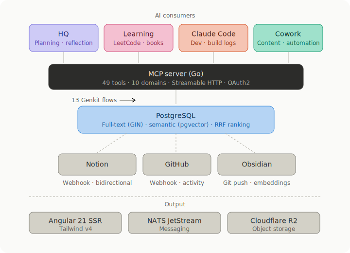
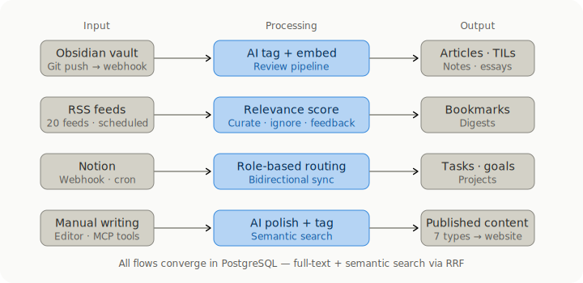
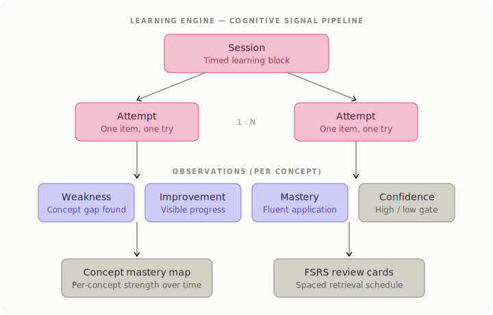

  

  <strong>English</strong> | <a href="README.zh-TW.md">繁體中文</a>

  

    
    
    
    
    
    
  

**koopa0.dev** is a personal operating system where multiple AI participants share a single, explicitly modeled semantic runtime — goals, projects, tasks, learning state, content, decisions — and coordinate through formal protocols to help one person track objectives, manage work, learn deliberately, produce content, and make better decisions.

It is not a blog. It is not a to-do app. It is not an LLM wrapper with a database behind it. It is a knowledge engine where **AI understands your work because the work is structurally modeled**, not because you described it well in a prompt.

  

## Why this exists

Most AI integrations follow a stateless pattern: every conversation starts from zero. The AI has no structured understanding of what you're working on, what you've learned, what you've committed to, or what you've deferred. It can only work with what you tell it in the moment.

koopa0.dev takes a different approach. The system maintains an explicit semantic model of your entire operating context — your goals and their milestones, your projects and their tasks, your learning sessions and their cognitive observations, your content pipeline and its review states, your daily commitments and what happened to them. Every AI participant reads from and writes to this shared model through MCP. When Learning Studio starts a session, it already knows which concepts you've struggled with, which items are due for spaced review, and which learning plan you're working through. When HQ builds your morning briefing, it sees yesterday's unresolved daily plan, pending directives, and goal progress — not because you summarized them, but because the state is there.

This is what makes the system different from a chatbot with memory. The AI doesn't remember that you mentioned a project last week. It reads the project's current status, its linked goal, its open tasks, and its recent activity from a structured schema. The understanding is precise, not reconstructed.

## How it works

The participant model is extensible — each participant is a first-class actor with a declared platform and a set of capability flags that define what it can do (issue directives, receive tasks, file reports, write journals). The current operational setup uses five participants, coordinating through a formal IPC (Inter-Participant Communication) protocol:

**HQ** is the CEO — it makes decisions, dispatches work, and tracks progress across the organization. **Content Studio** owns content strategy, from topic selection through writing to quality review. **Research Lab** conducts deep analysis and produces structured reports. **Learning Studio** acts as a cognitive coach, applying deliberate practice principles to guide skill development. **Claude Code** serves as the development agent, implementing features and fixing bugs directly in the codebase.

These participants don't just respond to commands. They issue **directives** (prioritized instructions with a full lifecycle: issued → acknowledged → resolved), file **reports** (both in response to directives and self-initiated), write **journal entries** (plans, context snapshots, reflections, metrics), and track **insights** (hypotheses with explicit invalidation conditions).

The critical distinction: a **directive** is not a task. "Research NATS exactly-once semantics and report findings" is a directive from HQ to Research Lab — it carries priority, requires acknowledgment, and is resolved by a report. A **task** is a concrete, completable unit of work that belongs to a project. These are different entities with different lifecycles because they represent genuinely different things. The system models this distinction explicitly, so AI participants never confuse an investigation request with a to-do item.

## The shared semantic runtime

The deeper innovation is not "multiple Claude instances collaborate." Multi-agent setups are common. What matters is that every participant operates inside the same semantic model, where concepts have precise, non-overlapping definitions:

**Goal vs. Project vs. Task.** A goal is an outcome you want to achieve ("Pass the CKA exam by Q3"). A project is a bounded effort with deliverables that may serve a goal ("Build a practice cluster and complete 50 mock questions"). A task is an atomic unit of work inside a project ("Set up kind cluster with Calico CNI"). These are not interchangeable labels — they have different schemas, different lifecycles, and different relationships. When AI sees a task, it knows which project it belongs to, which goal that project serves, and how much of the goal's milestone checklist is complete.

**Directive vs. Task.** A directive flows from HQ to a department. A task lives inside a project. They look similar from a distance, but their semantics diverge: directives require acknowledgment and are resolved by reports; tasks are advanced through a state machine (clarify → start → complete → defer → drop). Confusing them would mean losing the distinction between "investigate this" and "do this."

**Attempt vs. Plan completion.** Solving a LeetCode problem in a session (an attempt) is not the same as completing it in your learning plan. An attempt records what happened cognitively — where you got stuck, which concepts were weak, how long it took. Plan completion is a separate lifecycle event that requires linking to a concrete attempt as an audit trail. You can attempt a problem three times before it counts as complete in your plan. The system models both, so Learning Studio can distinguish "practiced but not yet solid" from "done."

**Journal vs. Insight.** A journal entry is a personal record — a plan, a reflection, a context snapshot. An insight is a trackable hypothesis with a stated invalidation condition. "I think my pattern recognition failures come from not reading constraints first" is an insight that starts unverified and can be confirmed or invalidated over time. These are different things, and the system treats them differently.

This explicitness is what lets AI do more than chat. When the semantic model is precise, AI can reason about your state rather than guess at it.

## The knowledge lifecycle

Everything in koopa0.dev flows through three stages: input, processing, and output.

  

**Input** captures knowledge from multiple sources. An Obsidian vault syncs notes, LeetCode solutions, and reading annotations. RSS feeds are fetched on schedule with HTTP ETag optimization. Notion syncs projects and goals. GitHub webhooks surface development activity. And every Claude participant contributes tasks, observations, and decisions through MCP.

**Processing** is where raw input becomes structured knowledge. A Genkit-powered AI pipeline classifies, summarizes, and scores content. A tag normalization engine resolves raw tags through aliases into a canonical taxonomy. pgvector embeddings (768 dimensions) power semantic search alongside PostgreSQL full-text search. And a knowledge graph built from wikilinks maps relationships between notes.

**Output** takes multiple forms. A public Angular SSR website presents articles, build logs, TILs, and a project portfolio. A private admin workspace provides dashboards for daily planning, task management, goal tracking, learning analytics, content review, and RSS curation. Every piece of knowledge is also queryable by any AI participant through MCP — the system feeds back into itself.

## Features

### PARA + GTD task and goal management

koopa0.dev fuses two productivity frameworks into a unified system. PARA provides the structural hierarchy — **Areas** (ongoing responsibilities like "Backend" or "Learning"), **Goals** (targeted outcomes with optional deadlines), **Milestones** (binary checkpoints within goals — goal progress equals completed milestones over total), and **Projects** (short-term efforts with deliverables). GTD provides the execution flow — **Capture** (zero-friction inbox), **Clarify** (promote to actionable todo), **Organize** (assign to projects, link to goals), **Reflect** (morning briefings, weekly reviews), and **Engage** (daily plan commitment).

The **Daily Plan** deserves special attention. Each planned item records who selected it, why it was chosen, and its position in the priority order. There is no auto-carryover — yesterday's unfinished work surfaces during the morning briefing, but you must consciously decide to defer or drop each item.

Why this matters: auto-carryover is convenient, but it silently erodes your relationship with your own commitments. When unfinished items roll forward automatically, you stop noticing them. You lose the signal that tells you "I'm consistently over-committing" or "this task keeps getting deferred — maybe it shouldn't be on the list." Forcing a daily reckoning is uncomfortable, but it keeps your plan honest. The system is designed so that ignoring yesterday's leftovers is not the default — confronting them is.

### Learning engine

The deepest module in the system, grounded in cognitive science research (Dunlosky et al. 2013, Ericsson's deliberate practice, Bjork's desirable difficulties).

  

A **Concept Ontology** organizes knowledge into a hierarchical tree by domain (LeetCode, Japanese, system design) and kind (pattern, skill, principle). **Learning Items** — individual problems, grammar points, or chapters — exist independently of notes and form their own relationship graph (easier/harder variants, prerequisites, follow-ups).

The core recording model has three layers. A **Session** is a timed learning block with a declared mode (retrieval, practice, mixed, review, reading). Within a session, each **Attempt** records one try at one item — the outcome (solved independently, needed hints, gave up), duration, where you got stuck, and which approach you used. Each attempt generates **Observations** — micro-level cognitive signals linked to specific concepts.

An observation is either a **weakness** (with severity: minor/moderate/critical), an **improvement**, or a demonstration of **mastery**. Eight cognitive weakness types are tracked: pattern recognition failure, constraint analysis weakness, approach selection confusion, state transition confusion, edge case blindness, implementation gap, complexity miscalculation, and loop condition instability.

Observations feed into a confidence-gated pipeline. High-confidence signals — those directly evidenced by behavior, like "attempted the problem for 20 minutes and couldn't identify the pattern" — are recorded automatically. Low-confidence signals — those inferred by AI, like "might have a state transition weakness based on the type of error" — require user confirmation before they enter the analysis data.

Why this gate matters: without it, AI-inferred observations would accumulate noise. Over time, the concept mastery map would reflect what the AI guessed rather than what actually happened. The confidence gate keeps the analytical foundation clean, so when Learning Studio says "your sliding window pattern recognition has degraded — here are three items to review," that assessment is grounded in verified signals, not speculation.

An FSRS-based spaced repetition engine schedules reviews for both content (article recall) and learning items (problem retention), driven by four-point ratings (Again / Hard / Good / Easy).

### Intelligent RSS

Feeds are managed with scheduling, priority levels, and filter rules. A fetch pipeline uses HTTP ETag and Last-Modified headers for efficiency, with automatic disabling after consecutive failures. An AI relevance scorer computes per-article scores based on keyword weights. A curation workflow moves items through unread → read → curated (promoted to bookmark or article) or ignored. Topic monitors proactively surface new content matching watched subjects.

### Content management and publishing

Seven content types serve different purposes: Article (deep technical writing), Essay (opinion pieces), Build Log (development records), TIL (daily learning), Note (technical notes), Bookmark (recommended resources with commentary), and Digest (weekly roundups). Content moves through a lifecycle (draft → review → published → archived) with AI review tiers ranging from auto-publish for low-risk content to strict human-approval gates.

## MCP tool design

koopa0.dev exposes 23 workflow-driven tools through MCP, organized in five layers.

The design principle behind these tools is that MCP should expose **semantic operations**, not database access. A CRUD-style MCP would give AI tools like `create_task`, `update_goal`, `insert_observation`. That works mechanically, but it forces the AI to understand the system's invariants — which status transitions are valid, when a proposal is needed, how maturity assessment works. Every AI participant would need to re-implement the same business logic, and mistakes would corrupt the data model.

Instead, koopa0.dev's tools encapsulate complete workflow steps. `advance_work` knows the valid state transitions for a task and enforces them. `propose_commitment` knows that goals, projects, and directives require human confirmation before creation. `record_attempt` knows how to extract observations and apply confidence gating. The intelligence is in the tools, not in the prompts.

**Context Suppliers** deliver situational awareness — `morning_context` assembles everything you need to start the day in a single call; `learning_dashboard` surfaces weakness trends, mastery levels, and review schedules; `search_knowledge` provides unified search across all content types.

**Commitment Gateway** enforces the two-step commitment pattern. `propose_commitment` lets AI draft goals, projects, milestones, directives, insights, or learning plans — but never creates them directly. Only after user confirmation does `commit_proposal` persist the entity.

This matters because commitments shape behavior. If AI could silently create goals or issue directives, the system would gradually fill with entities the user didn't consciously choose. Proposal-first ensures that every goal in the system is one you actually decided to pursue, every directive is one you actually issued, and every learning plan is one you actually committed to. The system preserves your ownership of your own agenda.

A related mechanism is **Semantic Maturity Assessment**. Before proposing any entity, the system evaluates input maturity on a four-level scale: M0 (vague — "I want to get better at English"), M1 (forming — "I want to improve my reading comprehension"), M2 (structured — "I want to read one NHK article per day and track unknown vocabulary"), M3 (actionable — ready for a goal with milestones). At M0, the AI stays in conversation to help you crystallize your thinking rather than creating a half-formed entity that pollutes the system. The goal is not to capture everything — it's to capture things that are ready to be captured.

**Lifecycle Transitions** manage state machines — `advance_work` moves tasks through clarify/start/complete/defer/drop; `plan_day` builds the daily commitment; `manage_plan` handles learning plan operations.

**Direct Recording** captures low-risk data with minimal friction — `capture_inbox` for quick thoughts, `write_journal` for reflections, `start_session` / `record_attempt` / `end_session` for the learning recording pipeline.

**Content Management** handles publishing workflows — `manage_content` for the full content lifecycle and `manage_feeds` for RSS subscription operations.

## Design philosophy

### AI understands you through structure, not prompts

The conventional approach to AI personalization is context windows and memory — feed the AI enough conversation history and it will "know" you. koopa0.dev takes a fundamentally different position: AI understands your work, your learning, and your priorities because these things are **explicitly modeled in a semantic schema**. The AI doesn't infer that you're working on a Kubernetes certification from scattered chat messages. It reads a goal entity with milestones, linked projects, and tracked progress. The understanding is structural, queryable, and shared across every participant.

This is what makes the system a stable operating context for multiple AI agents. Any Claude instance — whether it's HQ doing a morning briefing, Learning Studio running a practice session, or Content Studio planning next week's articles — reads the same structured state. There is no drift between participants, no "I think you mentioned..." — just the model.

### The system preserves your ownership

koopa0.dev is not trying to automate your judgment. It is trying to give you better tools for exercising it. Every design decision around friction — proposal-first commitments, confidence-gated observations, no auto-carryover, maturity assessment — exists to keep you as the decision-maker rather than a passive approver of AI suggestions.

The underlying conviction: a system that makes decisions for you eventually makes you worse at making decisions yourself. A system that presents you with structured information and waits for your call makes you better over time, because you're always practicing judgment against real data.

### Workflow semantics over raw access

The MCP layer exposes operations like `morning_context` and `advance_work`, not `SELECT * FROM tasks`. Each tool encapsulates a meaningful step in a workflow — valid transitions, required fields, side effects, invariant checks — so that AI participants interact with the system's semantics rather than its storage. This keeps the data model consistent regardless of which participant is acting, and it means the system's rules are enforced in one place rather than scattered across prompt instructions.

## What this enables

A few things that become possible when AI operates inside a shared semantic runtime rather than a chat window:

**Morning briefings that know what happened.** HQ doesn't ask what you did yesterday. It reads yesterday's daily plan, checks which items were completed, deferred, or dropped, surfaces pending directives, and shows goal progress against milestones. The briefing is generated from state, not from your recollection.

**Learning coaching grounded in evidence.** Learning Studio doesn't generically suggest "practice more sliding window problems." It sees that your last three attempts at sliding window items produced pattern-recognition-failure observations with moderate severity, that your mastery score for this concept has declined over two weeks, and that two items are overdue for spaced review. The coaching is specific because the evidence is specific.

**Content strategy informed by knowledge gaps.** Content Studio can cross-reference your learning observations with your published articles to identify topics where you've built depth but haven't written about them yet — or topics where you keep encountering weaknesses that a deep-dive article might help consolidate.

**Honest weekly reviews.** The system can show you not just what you accomplished, but what you consistently deferred, which goals stalled, which learning plans went inactive, and which insights remain unverified. This is not AI judgment — it's structured data presented clearly so you can judge for yourself.

## Tech stack

| Layer             | Choice                                          |
| ----------------- | ----------------------------------------------- |
| Backend           | Go (stdlib-first), PostgreSQL, pgx/v5, sqlc     |
| AI pipeline       | Genkit (Go), pgvector                           |
| Frontend          | Angular (SSR), Tailwind CSS                     |
| AI collaboration  | Claude (Cowork + Code), MCP                     |
| Spaced repetition | FSRS algorithm                                  |
| Search            | Full-text (tsvector) + Semantic (pgvector 768d) |

---

## License

This repository contains personal content and infrastructure. All rights reserved.
