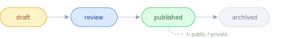

# koopa0.dev

<p align="center">
  
</p>

<p align="center">
  <a href="README.md">English</a> | <strong>繁體中文</strong>
</p>

一個「可以輸入、可以處理、可以輸出」的個人知識引擎。

不是部落格。部落格是「你寫文章 → 發布」。這個系統是：你的筆記、你訂閱的文章、你的 task 和 goal — 全部流進同一個資料庫，AI 幫你整理，你審核後發布，同時幫你追蹤學習進度、驗證假說、管理每日計畫。

<p align="center">
  
</p>

---

## 為什麼做這個

每次 AI 對話都從零開始。你在 Claude Web 規劃今天要做什麼，切到 Claude Code 寫程式 — 它不知道你的計畫。你上週學了 binary search 的 pattern — 這週忘了自己學過。你三個月前做了一個架構決策 — 今天做了相反的決策，因為當初的理由沒有留下來。

根本原因：**AI 環境之間沒有共享記憶**。每個 session 都是孤島。

koopa0.dev 用 MCP 不只是 tool access，而是 **共享記憶層**。四個 AI 環境連到同一個 Go server，讀寫同一個 PostgreSQL，透過結構化的 artifact（session notes、tasks、build logs、insights）互相協調。

你不再當 AI 工具之間的信差，而是決策者。

<p align="center">
  
</p>

---

## 核心概念

在看任何功能之前，先搞懂這六個東西。系統的一切都圍繞它們。

### Content — 成品

**任何最終會出現在網站上讓訪客看到的東西，都是一筆 content。**

| Type | 是什麼 | 例子 |
|------|--------|------|
| `article` | 深度技術文章 | 「Go error handling 完整指南」 |
| `essay` | 個人想法、非技術反思 | 「為什麼我離開大公司」 |
| `build-log` | 專案開發紀錄 | 「koopa0.dev Week 3: RSS pipeline」 |
| `til` | Today I Learned | 「TIL: psql 的 \watch 可以自動重跑 query」 |
| `note` | 技術筆記片段 | 「PostgreSQL JSONB 常用操作速查」 |
| `bookmark` | 推薦外部文章 + 你的評語 | 「Uber 的 Go style guide 值得看，因為...」 |
| `digest` | 週報/月報 | 「2026 第 12 週：完成了 RSS pipeline...」 |

所有 type 共用同一張表，走同一個生命週期：

<p align="center">
  
</p>

一句話：**content = 你願意掛上名字、讓別人看到的東西。**

### Note — 兩個不同的東西

系統裡有兩種 "note"，這是最容易搞混的地方：

| | Obsidian notes | Content type `note` |
|---|---|---|
| 是什麼 | Obsidian vault 裡的原始筆記 | 整理好的技術筆記成品 |
| 存在哪 | `notes` 表 | `contents` 表 |
| 誰看得到 | 只有 admin | published 後訪客可見 |
| 數量 | 幾百上千筆 | 精選，幾十筆 |

**關係**：Obsidian note（原始素材）→ 覺得值得分享 → 整理成 content（成品）→ publish。

Obsidian notes 還帶 embedding (vector)，是語義搜尋和知識圖譜的基礎。

### Topic & Tag — 知識組織

**Topic** = 高層級知識領域（Go、系統設計、AI），10-20 個，手動管理。

**Tag** = 細粒度標籤（pgvector、error-handling），自動從 Obsidian 提取。

Tag 有 **alias 系統** — 因為同一個概念在不同地方叫不同名字：

| Raw tag | → | Canonical |
|---------|---|-----------|
| `golang` | → | `go` |
| `JS` | → | `javascript` |
| `PostgreSQL` | → | `postgres` |

未知的 raw tag 會建立 unmapped alias，等 admin 決定 map / confirm / reject。

### Session Note — AI 的工作日誌

**不是你寫的，是 AI flow 自動產生的。不對外公開。**

| Type | 什麼時候產生 | 做什麼 |
|------|------------|--------|
| `plan` | 每天早上 | 今日計畫 |
| `reflection` | 每週日 | 週回顧 |
| `context` | session 結束 | 這次改了什麼 |
| `metrics` | 定期 | 數據快照 |
| `insight` | 發現 pattern | 假說紀錄 ↓ |

### Insight — 假說追蹤

Insight 是 session note 的特殊子類型，多了「假說 → 驗證」結構：

```yaml
content:    "relevance score < 0.3 的文章 90% 被 ignore"
hypothesis: "門檻應該從 0.2 調到 0.3"
evidence:   ["03-20: 15/17 ignored", "03-25: 12/14 ignored"]
status:     unverified → verified / invalidated → archived
conclusion: "確認有效，已調整"
```

**一句話：insight = AI 提出的假說，等你蒐集證據確認對不對。**

### Project — 專案

Project 有自己的表，跟 content 分開。一個 project 可以關聯多篇 content（build-logs、articles）和多個 tasks。

Project 可以從 Notion 同步，也可以手動建立。有 case study 欄位（problem / solution / architecture / results），讓專案頁面像作品集而不只是清單。

---

## 三大資料流

### 流 1：Obsidian → 網站

**Obsidian vault** → git push → GitHub webhook → Backend sync → `notes` 表 (原始素材) → AI 打 tag + embedding → 你決定哪些發布 → `contents` 表 → 審核 → **網站**

### 流 2：RSS → 網站

**RSS feeds** → 排程抓取 → TF-IDF 評分 → `collected_data` 表 → Admin 審核：**Curate** (→ bookmark content) / **Ignore** / **Feedback** (→ 改善評分)

每個 feed 有 filter config（deny path、title pattern、tag 過濾），在抓取階段就擋掉不要的。

### 流 3：Notion → 系統

**Notion workspace** → webhook / cron → 根據 source role 分流：
- `role=task` → tasks 表
- `role=goal` → goals 表
- `role=project` → projects 表
- ↩ 雙向：前端 complete task → Backend 回寫 Notion

雙向同步：前端 complete task → Backend 回寫 Notion。

---

## AI Pipeline

13 個 Genkit flow，全部用 Claude。

**內容處理**：ContentPolish（潤色）、ContentTags（自動打 tag）、ContentExcerpt（生成摘要）、ContentProofread（語法檢查）、ContentReview（品質審核）、ContentStrategy（策略建議）、BookmarkGenerate（書籤提取重點）、BuildLog（開發紀錄結構化）

**定期報告**：MorningBrief（每日計畫）、DailyDevLog（每日開發摘要）、WeeklyReview（週回顧）、DigestGenerate（週報/月報）

**專案追蹤**：ProjectTrack（分析 activity、更新狀態）

所有 flow 執行紀錄存在 `flow_runs` 表，可監控、可重試。

---

## MCP — AI 跟平台互動的方式

MCP (Model Context Protocol) 是讓 AI 環境操作這個系統的介面。45 個 tool，四個領域。

這不是 REST API 文件 — 這是 **AI 可以用的積木**。每個 tool 是一塊積木，你可以自由組合出適合自己的工作流。

### 積木 1：每日循環 (11 tools)

> 規劃 → 執行 → 回顧 → 調整。AI 幫你跑這個循環。

| 積木 | 做什麼 | 風險 |
|------|--------|------|
| `get_morning_context` | 一次拉回所有規劃所需的資料（tasks、plan、goals、insights、RSS） | 唯讀 |
| `get_reflection_context` | 一次拉回回顧所需的資料（plan vs actual、completions、insights） | 唯讀 |
| `get_session_delta` | 上次 session 到現在的所有變化 | 唯讀 |
| `save_session_note` | 寫入 session note（plan / reflection / context / metrics / insight） | 新增 |
| `get_session_notes` | 讀取指定日期/類型的 session notes | 唯讀 |
| `create_task` | 建立任務（同步到 Notion） | 新增 |
| `complete_task` | 完成任務（recurring task 自動推進 due date） | 不可逆 |
| `update_task` | 更新任務屬性 | 冪等 |
| `search_tasks` | 搜尋/篩選任務 | 唯讀 |
| `batch_my_day` | 批次設定今日任務 | 冪等 |
| `get_active_insights` | 查看待驗證的假說 | 唯讀 |

**`get_morning_context` 支援 `sections` 參數** — 不同環境拉不同子集。Claude Code 只需要 tasks + plan + build_logs（約 1/4 的資料量），不用拉全量。

**組合的可能性**：
- 早上開始 → `get_morning_context` → 看 insights → 決定 plan → `save_session_note(type=plan)` → `batch_my_day`
- 開發到一半發現問題 → `create_task` + `save_session_note(type=context)`
- 晚上回顧 → `get_reflection_context` → 驗證假說 → `update_insight` → `save_session_note(type=metrics)`
- 這些只是範例 — 你的循環可能完全不同

### 積木 2：知識與內容 (13 tools)

> 搜尋知識、管理內容、O'Reilly 學習、RSS 收藏。

| 積木 | 做什麼 | 風險 |
|------|--------|------|
| `search_knowledge` | 全域搜尋：content + Obsidian notes（4 路並行，含語義） | 唯讀 |
| `synthesize_topic` | 跨源知識合成 + gap analysis | 唯讀 |
| `get_content_detail` | 用 slug 拉完整內容 | 唯讀 |
| `create_content` | 建立草稿（7 種 type） | 新增 |
| `update_content` | 更新草稿/review 中的內容 | 冪等 |
| `publish_content` | 發布（不可逆） | 不可逆 |
| `list_content_queue` | 查看內容佇列（drafts / review / published） | 唯讀 |
| `get_decision_log` | 拉所有 decision-log 類型的筆記 | 唯讀 |
| `bookmark_rss_item` | 把 collected item 轉成 bookmark content（6 步 atomic） | 新增 |
| `search_oreilly_content` | 搜尋 O'Reilly 書/影片/課程 | 唯讀 |
| `get_oreilly_book_detail` | 看書的章節目錄 | 唯讀 |
| `read_oreilly_chapter` | 讀完整章節 | 唯讀 |
| `get_rss_highlights` | 最近收集的 RSS 精選 | 唯讀 |

**搜尋是 4 路並行**：content 全文搜尋 + Obsidian 文字搜尋 + Obsidian 語義搜尋 (embedding) + 去重。結果按 Reciprocal Rank Fusion 排序。

**O'Reilly 三件組** 是 progressive disclosure：search → detail（看目錄）→ read（讀章節）。

**組合的可能性**：
- 寫文章前 → `search_knowledge` 看以前寫過什麼 → `synthesize_topic` 看哪些面向缺內容 → `create_content` 開始寫
- 讀完一篇 RSS → `bookmark_rss_item` 存起來 + 加評語
- 做架構決策前 → `get_decision_log` 看過去類似的決策
- O'Reilly 學習 → search → 挑書 → 讀特定章節 → `save_session_note` 記錄心得

### 積木 3：開發與學習 (8 tools)

> 記錄開發、記錄學習、追蹤專案、分析弱點。

| 積木 | 做什麼 | 風險 |
|------|--------|------|
| `log_dev_session` | 記錄 coding session 為 build-log | 新增 |
| `log_learning_session` | 記錄學習成果（LeetCode / 讀書 / 課程） | 新增 |
| `get_project_context` | 單一 project 的完整 context | 唯讀 |
| `list_projects` | 列出所有 active projects | 唯讀 |
| `update_project_status` | 更新 project 狀態 | 冪等 |
| `get_coverage_matrix` | Topic × Result 矩陣（哪些練了、成績如何） | 唯讀 |
| `get_tag_summary` | Tag 頻率統計 | 唯讀 |
| `get_weakness_trend` | 單一弱點的時間趨勢 | 唯讀 |

**`log_dev_session` 是跨環境橋樑** — `plan_summary` 和 `review_summary` 讓 HQ 不需要看 git diff 就能理解開發進度。

**學習分析三件組**：`get_tag_summary`（找高頻弱點）→ `get_weakness_trend`（看趨勢）→ `get_coverage_matrix`（看整體分佈）。

**`log_learning_session` 有 controlled vocabulary** — 35+ 標準化 tag（two-pointers、sliding-window、dp...）+ 結果標籤（ac-independent、ac-with-hints...）+ 弱點標籤（weakness:xxx）。標準化讓分析查詢不會碎片化。

### 積木 4：系統與基礎設施 (13 tools)

> 監控、RSS 管理、目標追蹤、insight lifecycle、週報。

| 積木 | 做什麼 | 風險 |
|------|--------|------|
| `get_system_status` | 系統健康度（flow runs、feed health） | 唯讀 |
| `get_collection_stats` | RSS 收集品質（per-feed score、item counts） | 唯讀 |
| `get_weekly_summary` | 週報（per-project completions、trends） | 唯讀 |
| `get_goal_progress` | 目標進度（含 drift analysis） | 唯讀 |
| `update_goal_status` | 更新目標狀態 | 冪等 |
| `update_insight` | 更新 insight（status / 追加 evidence / conclusion） | 冪等 |
| `get_learning_progress` | 學習指標（note growth、top tags） | 唯讀 |
| `get_recent_activity` | 最近活動（可按 source 過濾） | 唯讀 |
| `add_feed` | 新增 RSS 訂閱 | 新增 |
| `update_feed` | 更新 feed（含啟用/停用） | 冪等 |
| `remove_feed` | 刪除 feed（不可逆） | 不可逆 |
| `list_feeds` | 列出所有 feed | 唯讀 |
| `trigger_pipeline` | 手動觸發 pipeline（rss_collector / notion_sync） | 不可逆 |

**`get_system_status` vs `get_collection_stats`** — 不同層級。system_status 看「job 有沒有正常跑」（infra），collection_stats 看「收了什麼、品質如何」（data quality）。

### MCP 設計原則

這些原則決定了 tool 為什麼長這樣：

| 原則 | 意思 |
|------|------|
| 一個 tool、一個動作、一個風險等級 | 不用 multiplexer pattern（`manage_X(action=...)`）。tool 名字就是意圖 |
| AI 不呼叫 AI | 如果 consumer 已經是 LLM，不繞一圈讓 server 再叫另一個 LLM |
| Schema 強制 | Session note 有 required metadata — insight 必須有 hypothesis + 證偽條件 |
| 聚合視圖凍結在 4 個 | morning / reflection / delta / weekly 是「便利包」。新功能只加 surgical tool，不膨脹聚合視圖 |
| 收斂才能擴張 | 加 tool 前問：「過去兩週有幾個 session 因為缺這個 tool 而失敗？」0 → backlog，3+ → 立刻做 |
| 描述品質 > tool 數量 | 45 個描述清楚的 tool 比 25 個猜不準的 tool 好 |

完整 MCP tool reference 見 [`docs/MCP-TOOLS-REFERENCE.md`](docs/MCP-TOOLS-REFERENCE.md)。

---

## 前端 — 訪客看到什麼

### 公開頁面

| 頁面 | 內容 |
|------|------|
| 首頁 | Hero + 精選專案 + 最新 6 篇 + Tech Stack + CTA |
| 文章列表 | 3 欄 grid、inline 搜尋 (debounce 300ms)、tag 過濾、分頁 |
| 文章詳情 | TOC 側邊欄、syntax highlight、copy code、related articles |
| 專案列表 | 狀態過濾、featured 標記 |
| 專案詳情 | Case study 格式：Problem → Solution → Architecture → Results |
| TIL | 短篇學習紀錄 |
| Notes | 技術筆記片段 |
| Tag 瀏覽 | 某 tag 下所有 content（混合類型） |
| 全站搜尋 | ⌘K 搜尋 / articles 頁面 inline 搜尋 |

### Admin Dashboard

| 頁面 | 用途 |
|------|------|
| Dashboard | 系統全局：stats grid + drift report + learning dashboard + quick sync |
| Today | 個人每日：My Day tasks + insights + planning heatmap |
| Contents | 內容 CRUD + status/type/visibility 過濾 |
| Editor | Markdown 編輯 (edit/preview/split) + AI polish + image upload |
| Review | 審核佇列：approve / reject / edit |
| Feeds | RSS 管理：CRUD + filter config |
| Collected | 收集審核：feedback + ignore |
| Tasks | 任務管理：My Day 視圖、priority/energy filter |
| Goals | 目標追蹤：唯讀 + status 切換 |
| Projects | 專案 CRUD（含 case study 欄位） |
| Tags | Canonical tags + Alias 管理 + backfill + merge |
| Notion Sources | Notion database 連接 + role 設定 |
| Flow Runs | AI flow 監控 + retry |
| Activity | 變更紀錄（session 視圖 / timeline 視圖） |
| Insights | 假說管理：verify / invalidate / add evidence |
| Pipeline | 7 個手動觸發按鈕 |

---

## 技術棧

| 層 | 技術 |
|----|------|
| 後端 | Go 1.26+, net/http (std lib routing) |
| 資料庫 | PostgreSQL, pgx/v5, sqlc |
| 搜尋 | tsvector + GIN (全文), pgvector + HNSW (語義) |
| AI Pipeline | Genkit Go (13 flows), Claude |
| 訊息佇列 | NATS (Core + JetStream) |
| 快取 | Ristretto (in-memory) |
| 前端 | Angular 21, Tailwind CSS v4, SSR |
| 儲存 | Cloudflare R2 |
| 整合 | Notion API, GitHub Webhook, Obsidian vault |
| 協定 | MCP (Model Context Protocol) |

## Repository 結構

```
frontend/     Angular 21 前端（SSR + Tailwind v4）
backend/      Go API + MCP server + AI pipeline
docs/         設計文件
```

## 開始開發

見 [`frontend/CLAUDE.md`](frontend/CLAUDE.md) 和 [`backend/CLAUDE.md`](backend/CLAUDE.md)。

## License

本 repository 包含個人內容與基礎設施。All rights reserved.
