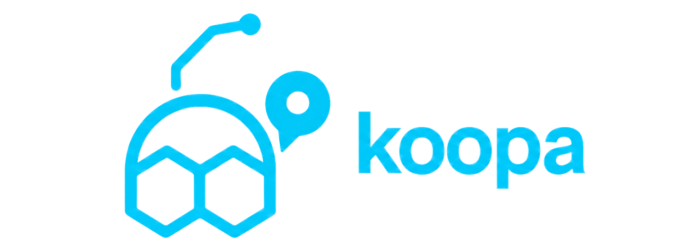

  

  <a href="README.md">English</a> | <strong>繁體中文</strong>

  
  
  

  
  
  

  <a href="https://koopa0.dev"><strong>koopa0.dev&nbsp;↗</strong></a>

**koopa** 是一個私有的個人規劃與發佈系統 — 把你的 area、goal、project、daily work 與可發佈的寫作放在同一個地方，讓 AI agent 在明確邊界內協作。

這些 agent 共享同一份工作狀態：它們讀的是跟你一樣的即時規劃，而不是你記得告訴它們的那些。決定的人始終只有你 — 它們檢視、起草、提案，由你決定什麼留下。知識寫作與檢索留在 Obsidian／Yomihon。

## 為什麼存在

你手上的事很多 —— 要持續顧的責任、想達成的目標、進行中的專案、每天的待辦、寫到一半的東西。你要的是有人幫你讓這一切往前走：記得你做到哪、把快停滯的提醒出來、跟你一起推進 —— 而不是又一個要你不斷餵資料的 app。

大多數 AI 工具做不到，因為它們會忘。每次對話從零開始，你加的助手越多，花在重新解釋自己的時間就越多。koopa 改成把工作本身存起來 —— 你的目標、專案、計畫、寫作都放在同一個地方，每個 agent 都讀得到。所以一個助手可以叫出你的晨間 briefing、看你昨天完成了什麼、起草下一篇、再交回給你拍板，全程不用你重講一次。它幫你扛事，但從不悄悄替你接手。

## 運作方式

重要的分界不是「人 vs. agent」，而是「流程 vs. 決策」。agent 負責流程：檢視目前工作、起草、提案，都在跟你的對話裡完成。你負責決策：agent 可以建議一個新 goal、或交一篇完成的文章，但在你於 admin UI 接受之前，它都只是草稿。它們靠共享狀態協調，從不把工作互相派來派去。

| 誰 | 角色 |
|---|---|
| **你**（Koopa） | 唯一的決策者 |
| **Claude Code** | 這個 repo 的開發 session — 檢視、build log、content 草稿 |
| **Hermes** | 按排程整理個人 Obsidian vault |
| **Codex** | 開發協作者 — repo 工作與 code review |

這道切分就是重點。agent 能自由地跑 — 丟一個 todo、起草一份提案、把文章推進你的審核佇列 — 正是因為承諾權留在你手上。沒有這道閘門，自主只會讓系統淹沒在你從沒決定要保留的東西裡。

## 裡面有什麼

**規劃與承諾。** 你的工作用 PARA + GTD 的方式整理 — area、帶 milestone 的 goal、project、todo，以及 daily plan。daily plan 不會默默把昨天沒做完的事滾到今天；它會在晨間 briefing 裡重新浮現，讓你決定哪些留下。

**寫作與發佈。** 五種內容 — article、essay、build log、TIL、digest — 走一套簡單的編輯流程，從草稿到發佈。agent 可以交一篇完成的草稿，被退回後再改一次，但發佈的人只有你。

**共享上下文。** agent 透過 MCP 讀取目前的規劃狀態 — goal、project、todo 與 daily plan。Koopa 不複製或搜尋你的知識庫；知識寫作與檢索留在 Obsidian／Yomihon。

**一條歷史。** 每一次改動都記下是誰做的，所以整個系統保有一條單一、可信的時間軸 — 什麼時候發生了什麼。

## 範圍與限制

這是設計上的單管理員系統：一個人，多個 AI agent — 沒有團隊帳號、沒有角色、沒有「分享給同事」。管理端是私有的；公開網站只顯示一部分內容（article、build log、TIL），而且只有在你發佈之後。Goal 與私人筆記永遠私有。Koopa 保存規劃狀態並發佈選定的寫作；私人知識庫活在 Obsidian。如果你想要團隊 wiki 或 Notion clone，不是這個。

## Provider 部署邊界

跨 repository 的 `trader-db` cutover、拓撲、停止與 rollback 契約請見
[Provider deployment boundary](README.md#provider-deployment-boundary)。英文 README 為唯一正式版本；本頁不複製可能產生版本分歧的操作指令。

---

## 授權

**保留所有權利（All Rights Reserved）** — 見 [LICENSE](LICENSE)。
