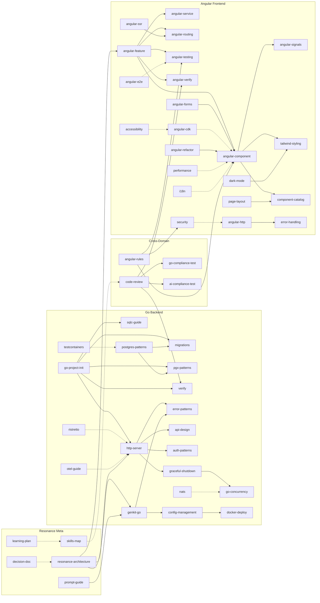

# Skill: Skills Map

Index of all skills and their relationships. Use this to find related skills when working on a task.

---

## Dependency Graph

---

## Task → Skills Quick Lookup

| Task | Primary Skill | Also Read |
|------|---------------|-----------|
| Build new Go feature | `go-project-init` | `migrations`, `sqlc-guide`, `http-server`, `error-patterns` |
| Build new Angular feature | `angular-feature` | `angular-component`, `angular-routing`, `angular-testing`, `component-catalog` |
| Build new Angular page | `page-layout` | `component-catalog`, `angular-routing`, `tailwind-styling` |
| Build new Angular component | `angular-component` | `angular-signals`, `tailwind-styling`, `component-catalog`, `angular-cdk` |
| Write Go HTTP handler | `http-server` | `error-patterns`, `api-design`, `auth-patterns` |
| Write Angular HTTP service | `angular-http` | `error-handling`, `angular-signals` |
| Write Angular form | `angular-forms` | `angular-component`, `tailwind-styling` |
| Set up Go database | `postgres-patterns` | `pgx-patterns`, `migrations`, `sqlc-guide`, `testcontainers` |
| Write Go concurrency | `go-concurrency` | `graceful-shutdown` |
| Write Genkit AI flow | `genkit-go` | `error-patterns`, `config-management` |
| Do PR review | `code-review` | `verify`, `angular-verify`, `go-compliance-test`, `ai-compliance-test` |
| Verify Go code | `verify` | `go-compliance-test` |
| Verify Angular code | `angular-verify` | `ai-compliance-test` |
| Deploy | `docker-deploy` | `config-management`, `graceful-shutdown` |
| Add caching (Go) | `ristretto` | `http-server` |
| Add messaging (Go) | `nats` | `go-concurrency` |
| Add observability (Go) | `otel-guide` | `http-server` |
| Angular SSR setup | `angular-ssr` | `angular-routing`, `performance` |
| Refactor legacy Angular | `angular-refactor` | `angular-component`, `angular-signals` |
| Write Angular tests | `angular-testing` | `angular-e2e`, `ai-compliance-test` |
| Write Go tests | `testcontainers` | `go-compliance-test` |
| Dark/light mode | `dark-mode` | `tailwind-styling` |
| i18n setup | `i18n` | `angular-component` |
| Accessibility audit | `accessibility` | `angular-cdk` |
| Performance audit | `performance` | `angular-verify` |
| Security audit | `security` | `code-review`, `auth-patterns` |
| Style UI | `tailwind-styling` | `component-catalog`, `dark-mode` |
| Resonance architecture discussion | `resonance-architecture` | `genkit-go`, `http-server`, `angular-feature` |
| Write AI prompt | `prompt-guide` | `genkit-go`, `resonance-architecture` |
| Make technical decision | `decision-doc` | `resonance-architecture` |
| Learn new topic | `learning-plan` | *(depends on topic)* |

---

## Skill Counts

- **Go Backend**: 19 skills (visible in mermaid graph above)
- **Angular Frontend**: 22 skills (visible in mermaid graph above)
- **Resonance Meta**: 4 skills — `resonance-architecture`, `prompt-guide`, `decision-doc`, `learning-plan`
- **Cross-Domain**: 4 skills — `code-review`, `ai-compliance-test`, `go-compliance-test`, `skills-map`
