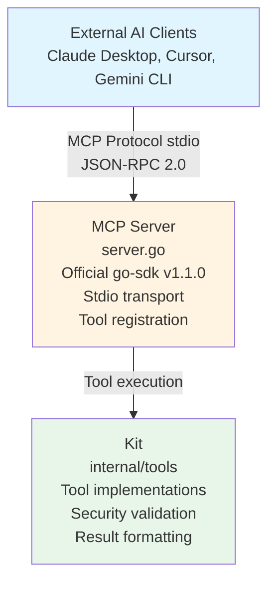

# MCP Server Package

Model Context Protocol (MCP) server implementation exposing Koopa's tools to external AI clients.

[繁體中文](./README_ZH_TW.md)

---

## Design Philosophy

The MCP Server package follows **Direct Integration principles** from the Koopa Comprehensive Strategy:

### Core Principle: Direct Inline Handling

**NO conversion layer** - MCP responses are built directly in tool handlers, following Go standard library patterns like `net/http.Handler`.

**Why No Conversion Layer?**

**Rejected Patterns**:
- `adaptResult()` - Creates unnecessary abstraction
- `toResponse()` - Adds complexity without value
- `NewToolResult()` - Not idiomatic Go

**Go Standard Library Approach**:
```
net/http.Handler → Build response directly in handler
database/sql.Scan → Convert directly at point of use
encoding/json → Direct marshaling, no intermediate layer
```

**Our Approach**:
```
MCP Tool Handler → Build MCP response directly
                → NO intermediate conversion functions
                → Inline handling like net/http
```

**Benefits**:
- **Simplicity**: One less layer to understand and maintain
- **Flexibility**: Each tool can customize response format
- **Go Idiomatic**: Follows stdlib conventions
- **Performance**: No unnecessary data transformations

---

## Architecture



---

## Components

### Server

The main MCP server that:
1. Wraps the official MCP SDK server
2. Holds a Kit instance for tool execution
3. Registers tools to the MCP protocol
4. Handles stdio transport communication

### Config

Server configuration structure:
- **Name**: Server name (e.g., "koopa")
- **Version**: Server version string
- **KitConfig**: Tool kit dependencies (see internal/tools)

### Transport

Uses **stdio transport** (standard for MCP):
- **stdin**: Receives JSON-RPC requests from client
- **stdout**: Sends JSON-RPC responses to client
- **stderr**: Logs (not visible to client)

---

## MCP Protocol

### JSON-RPC 2.0

All communication uses JSON-RPC 2.0 format:

**Request**:
```json
{
  "jsonrpc": "2.0",
  "id": 1,
  "method": "tools/call",
  "params": {
    "name": "readFile",
    "arguments": {"path": "README.md"}
  }
}
```

**Response**:
```json
{
  "jsonrpc": "2.0",
  "id": 1,
  "result": {
    "content": [{"text": "file content..."}],
    "isError": false
  }
}
```

### Protocol Lifecycle

1. **Initialize**: Client sends initialize request
2. **Capabilities**: Server responds with capabilities (tools, logging, etc.)
3. **Tool Calls**: Client calls tools via tools/call method
4. **Responses**: Server returns results via CallToolResult
5. **Shutdown**: Client closes stdin to terminate server

---

## Tool Registration

### Direct Inline Pattern

Each tool is registered with a handler that:
1. Extracts input from MCP request
2. Calls Kit method
3. Builds MCP response **directly inline**

**Example**: readFile tool registration

```
registerReadFile():
  1. Define input schema (ReadFileInput struct)
  2. Generate JSON schema from struct
  3. Register tool handler:
     - Extract path from input
     - Call kit.ReadFile()
     - Handle Result inline:
       * If error → Build error response
       * If success → Build success response
     - NO conversion functions
```

### Error Handling

**Agent Errors** (from Kit Result):
- Status: StatusError
- Return: CallToolResult{IsError: true, Content: error text}
- Client sees error and can retry/adjust

**System Errors** (Go error):
- Return: nil, nil, error
- MCP SDK handles error
- Client sees system failure

---

## Security

### Input Validation

All inputs are validated through Kit's security validators:
- **Path**: Prevents path traversal
- **Command**: Blocks dangerous commands
- **URL**: SSRF protection
- **Env**: Filters sensitive variables

### Transport Security

- **Stdio Only**: No network exposure
- **Local Process**: Client and server in same trust boundary
- **No Authentication**: Relies on OS-level process isolation

### Logging

- **stdout**: Reserved for JSON-RPC only
- **stderr**: All application logs
- **No Secrets**: Logs filtered for sensitive data

---

## Integration

### Claude Desktop

Configuration in `~/Library/Application Support/Claude/claude_desktop_config.json`:

```json
{
  "mcpServers": {
    "koopa": {
      "command": "/path/to/koopa",
      "args": ["mcp"],
      "env": {
        "GEMINI_API_KEY": "your-key",
        "DATABASE_URL": "your-db"
      }
    }
  }
}
```

### Cursor IDE

Similar configuration in Cursor's settings.

### Gemini CLI

Can be integrated via stdio pipe.

---

## CLI Command

Start MCP server:

```bash
koopa mcp
```

**What it does**:
1. Initializes application (database, knowledge store, etc.)
2. Creates Kit with security validators
3. Creates MCP Server
4. Registers tools
5. Starts stdio transport (blocks until stdin closes)
6. Handles graceful shutdown on SIGINT/SIGTERM

---

## Design Decisions

### Why Official SDK?

**Alternative Considered**: Implement MCP protocol manually
**Decision**: Use official go-sdk v1.1.0
**Rationale**:
- Maintained by MCP team
- Protocol compliance guaranteed
- Handles low-level details (framing, JSON-RPC, etc.)
- Regular updates for spec changes

### Why Stdio Transport?

**Alternative Considered**: HTTP transport, WebSocket
**Decision**: Use stdio transport
**Rationale**:
- Standard for MCP servers
- Simple process model (start/stop)
- No port conflicts
- Works with all MCP clients (Claude Desktop, Cursor, etc.)

### Why Direct Inline Handling?

**Alternative Considered**: Create conversion layer (adaptResult, toResponse, etc.)
**Decision**: Build responses directly in handlers
**Rationale**:
- Follows Go stdlib patterns (net/http, database/sql)
- Simpler codebase (one less layer)
- More flexible (each tool can customize)
- Easier to understand (no jumping between functions)

### Why Kit Integration?

**Alternative Considered**: Implement tools directly in MCP package
**Decision**: Use existing Kit from internal/tools
**Rationale**:
- Reuses tool implementations (DRY principle)
- Shares security validators
- Consistent behavior across Genkit flows and MCP
- Single source of truth for tool logic

---

## Testing

### Unit Testing
Tests verify:
- Server creation and configuration
- Tool registration
- Input schema generation
- Config validation

### Integration Testing
End-to-end tests verify:
- Claude Desktop integration
- Tool invocation via MCP protocol
- Response format correctness

### Coverage
Current test coverage: **47.4%**

Target areas for improvement:
- More tool registration tests
- Protocol error handling tests
- Stdio transport edge cases

---

## Known Limitations

### Single Tool Implementation

Currently only `readFile` is fully integrated. Other tools registered in Kit are:
- Available in Genkit flows
- Not yet registered in MCP server

**Planned**: Incrementally add tool registrations in future iterations.

### Protocol Version

- **Client (Claude Desktop)**: 2025-06-18
- **SDK Default**: 2024-11-05
- **Status**: Version negotiation works, but monitor for incompatibilities

### Performance

Stdio transport is synchronous and single-threaded:
- **Pro**: Simple and reliable
- **Con**: No concurrent requests
- **Impact**: Acceptable for IDE use cases (sequential tool calls)

---

## Future Enhancements

### More Tools
Register remaining Kit tools:
- writeFile, listFiles, deleteFile, getFileInfo
- executeCommand, getEnv, currentTime
- httpGet
- searchHistory, searchDocuments, searchSystemKnowledge

### Logging
Enhanced logging options:
- Configurable log levels
- Structured logging to file
- Trace IDs for debugging

### Resources
MCP resources support:
- Expose file:// URIs
- Template prompts
- Context providers

### Sampling
MCP sampling support:
- LLM completion requests
- Streaming responses

---

## Troubleshooting

### Server Not Starting

**Symptom**: `koopa mcp` exits immediately
**Causes**:
- Missing environment variables (GEMINI_API_KEY, DATABASE_URL)
- Database connection failure
- Working directory permissions

**Fix**: Check stderr logs for error messages

### Tool Not Visible in Client

**Symptom**: Tool registered but not showing in Claude Desktop
**Causes**:
- Client cache not refreshed
- Protocol version mismatch
- Tool registration error

**Fix**: Restart Claude Desktop, check server logs

### Logs Corrupting Protocol

**Symptom**: JSON parsing errors in client
**Causes**:
- Logs written to stdout instead of stderr

**Fix**: Ensure all logging uses stderr (already fixed in cmd/execute.go)

---

## Related Documentation

- [PHASE2_IMPLEMENTATION_PLAN.md](../../PHASE2_IMPLEMENTATION_PLAN.md): Implementation plan
- [PHASE2-DESIGN-RATIONALE.md](../../PHASE2-DESIGN-RATIONALE.md): Why no conversion layer
- [docs/mcp-server-usage.md](../../docs/mcp-server-usage.md): Usage guide
- [internal/tools/README.md](../tools/README.md): Tool implementations
- [MCP Specification](https://spec.modelcontextprotocol.io/): Official protocol spec
