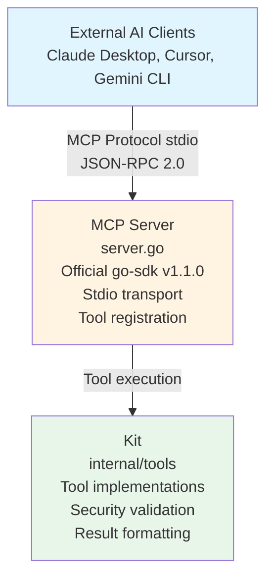

# MCP Server Package

Model Context Protocol server exposing Koopa's tools to external AI clients via stdio transport.

[繁體中文](./README_ZH_TW.md)

---

## Design Philosophy

The MCP Server package follows the **Direct Integration principle**: build protocol responses inline within handlers—no conversion layers, no adapters, following Go stdlib patterns like `net/http.Handler`.

### Core Principle: Direct Inline Handling

**NO conversion layer** - MCP responses constructed directly in tool handlers.

**Rejected Patterns**:
- `adaptResult()` - Unnecessary abstraction
- `toResponse()` - Complexity without value
- `NewToolResult()` - Not idiomatic Go

**Go Standard Library Approach**:
```
net/http.Handler     → Build response directly in handler
database/sql.Scan    → Convert directly at point of use
encoding/json        → Direct marshaling, no intermediate layer
```

**Our Approach**:
```
MCP Tool Handler → Build MCP response directly
                 → NO intermediate conversion functions
                 → Inline handling like net/http
```

**Benefits**:
- **Simplicity**: One less layer to understand and maintain
- **Flexibility**: Each tool can customize response format
- **Go Idiomatic**: Follows stdlib conventions
- **Performance**: No unnecessary data transformations

---

## Architecture



**Three-layer architecture**: External AI Clients → MCP Server (stdio/JSON-RPC) → Kit (tools)

---

## Design Decisions

### Why Direct Inline Handling?

**Problem**: Traditional adapter patterns add unnecessary abstraction layers between MCP protocol and tool execution.

**Solution**: Build MCP `CallToolResult` directly in tool registration handlers.

**Benefits**:
- Simpler codebase—one less layer to debug
- Each tool handler controls its own response format
- Follows Go stdlib patterns (`net/http.Handler`, `database/sql`)
- Zero performance overhead from conversions

### Why Official MCP SDK?

**Problem**: Implementing JSON-RPC 2.0 + MCP protocol manually is error-prone.

**Solution**: Use official `go-sdk v1.1.0` from Model Context Protocol team.

**Benefits**:
- Protocol compliance guaranteed
- Handles low-level details (framing, JSON-RPC, version negotiation)
- Regular updates for spec changes
- Community-vetted implementation

### Why Stdio Transport?

**Problem**: Need standardized IPC mechanism between AI client and MCP server.

**Solution**: Use stdio transport (stdin/stdout/stderr).

**Benefits**:
- MCP standard—works with all clients (Claude Desktop, Cursor, etc.)
- Simple process model (start/stop)
- No port conflicts or network configuration
- OS-level security through process isolation

### Why Kit Integration?

**Problem**: Duplicating tool logic in MCP server creates maintenance burden.

**Solution**: MCP server delegates to existing `internal/tools.Kit`.

**Benefits**:
- DRY principle—single tool implementation
- Shared security validators across Genkit flows and MCP
- Consistent behavior regardless of invocation method
- Single source of truth for tool logic

---

## Error Handling

**Agent Errors** (from Kit `Result`):
- Status: `StatusError`
- Return: `CallToolResult{IsError: true, Content: error text}`
- Client sees error and can retry/adjust strategy

**System Errors** (Go `error`):
- Return: `nil, nil, error`
- MCP SDK handles error
- Client sees system failure

---

## Design Influences

### Model Context Protocol

**Source**: [MCP Specification](https://spec.modelcontextprotocol.io/) - Anthropic's open protocol for AI-application integration

**Design Philosophy**:
- **Tool-centric**: AI clients discover and invoke tools via standardized protocol
- **Transport-agnostic**: Supports stdio, HTTP, WebSocket
- **JSON-RPC 2.0**: Leverages existing RPC standard for request/response
- **Client-server model**: Clear separation between AI client and tool server

**Why we adopted it**:
- Standard protocol for AI tool integration
- Works with multiple AI clients (Claude Desktop, Cursor, custom clients)
- Stdio transport provides secure, simple IPC
- Active development and community support

### MCP Go SDK

**Source**: [go-sdk v1.1.0](https://github.com/modelcontextprotocol/go-sdk) - Official Go implementation

**Design Philosophy**:
- **Handler-based**: Tool handlers register callbacks, similar to `http.HandleFunc`
- **Type-safe**: Strongly-typed tool definitions with schema generation
- **Protocol abstraction**: Hides JSON-RPC 2.0 complexities
- **Transport flexibility**: Supports stdio, HTTP, custom transports

**Why we adopted it**:
- Zero boilerplate for JSON-RPC handling
- Type-safe tool registration with automatic schema generation
- Maintained by MCP team—protocol compliance guaranteed
- Production-ready error handling and logging
