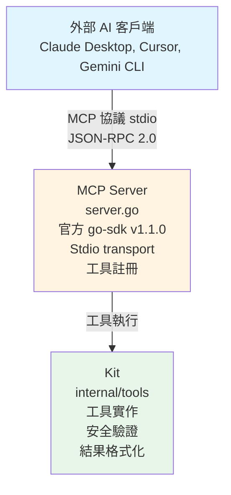

# MCP Server 套件

Model Context Protocol 伺服器通過 stdio transport 將 Koopa 的工具暴露給外部 AI 客戶端。

[English](./README.md)

---

## 設計理念

MCP Server 套件遵循**直接整合原則**：在處理器中內聯構建協議回應—無轉換層、無適配器，遵循 Go stdlib 模式如 `net/http.Handler`。

### 核心原則：直接內聯處理

**無轉換層** - MCP 回應直接在工具處理器中構建。

**拒絕的模式**：
- `adaptResult()` - 不必要的抽象
- `toResponse()` - 增加複雜性但無價值
- `NewToolResult()` - 不符合 Go 慣例

**Go 標準庫方法**：
```
net/http.Handler     → 直接在處理器中構建回應
database/sql.Scan    → 在使用點直接轉換
encoding/json        → 直接序列化，無中間層
```

**我們的方法**：
```
MCP Tool Handler → 直接構建 MCP 回應
                 → 無中間轉換函數
                 → 像 net/http 一樣內聯處理
```

**優點**：
- **簡單性**：少一層需要理解和維護
- **靈活性**：每個工具可以自定義回應格式
- **Go 慣用**：遵循標準庫慣例
- **效能**：無不必要的資料轉換

---

## 架構



**三層架構**：外部 AI 客戶端 → MCP Server（stdio/JSON-RPC）→ Kit（工具）

---

## 設計決策

### 為什麼直接內聯處理？

**問題**：傳統適配器模式在 MCP 協議和工具執行之間增加不必要的抽象層。

**解決方案**：直接在工具註冊處理器中構建 MCP `CallToolResult`。

**優點**：
- 更簡單的代碼庫—少一層需要除錯
- 每個工具處理器控制自己的回應格式
- 遵循 Go stdlib 模式（`net/http.Handler`、`database/sql`）
- 零轉換效能開銷

### 為什麼使用官方 MCP SDK？

**問題**：手動實作 JSON-RPC 2.0 + MCP 協議容易出錯。

**解決方案**：使用 Model Context Protocol 團隊的官方 `go-sdk v1.1.0`。

**優點**：
- 協議合規性保證
- 處理底層細節（framing、JSON-RPC、版本協商）
- 規格變更的定期更新
- 社群審查的實作

### 為什麼使用 Stdio Transport？

**問題**：需要 AI 客戶端和 MCP 伺服器之間的標準化 IPC 機制。

**解決方案**：使用 stdio transport（stdin/stdout/stderr）。

**優點**：
- MCP 標準—與所有客戶端相容（Claude Desktop、Cursor 等）
- 簡單的進程模型（啟動/停止）
- 無端口衝突或網路配置
- 通過進程隔離的作業系統級安全性

### 為什麼整合 Kit？

**問題**：在 MCP 伺服器中複製工具邏輯造成維護負擔。

**解決方案**：MCP 伺服器委託給現有的 `internal/tools.Kit`。

**優點**：
- DRY 原則—單一工具實作
- Genkit flows 和 MCP 間共享安全驗證器
- 無論調用方法如何都保持一致行為
- 工具邏輯的單一事實來源

---

## 錯誤處理

**Agent Errors**（來自 Kit `Result`）：
- 狀態：`StatusError`
- 返回：`CallToolResult{IsError: true, Content: 錯誤文字}`
- 客戶端看到錯誤並可以重試/調整策略

**System Errors**（Go `error`）：
- 返回：`nil, nil, error`
- MCP SDK 處理錯誤
- 客戶端看到系統故障

---

## 設計影響

### Model Context Protocol

**來源**：[MCP Specification](https://spec.modelcontextprotocol.io/) - Anthropic 的 AI 應用整合開放協議

**設計理念**：
- **以工具為中心**：AI 客戶端通過標準化協議發現和調用工具
- **傳輸無關**：支援 stdio、HTTP、WebSocket
- **JSON-RPC 2.0**：利用現有的 RPC 標準進行請求/回應
- **客戶端-伺服器模型**：AI 客戶端和工具伺服器之間的清晰分離

**為什麼採用它**：
- AI 工具整合的標準協議
- 與多個 AI 客戶端相容（Claude Desktop、Cursor、自定義客戶端）
- Stdio transport 提供安全、簡單的 IPC
- 活躍的開發和社群支援

### MCP Go SDK

**來源**：[go-sdk v1.1.0](https://github.com/modelcontextprotocol/go-sdk) - 官方 Go 實作

**設計理念**：
- **基於處理器**：工具處理器註冊回調，類似 `http.HandleFunc`
- **類型安全**：帶 schema 生成的強類型工具定義
- **協議抽象**：隱藏 JSON-RPC 2.0 複雜性
- **傳輸靈活性**：支援 stdio、HTTP、自定義傳輸

**為什麼採用它**：
- 零樣板代碼處理 JSON-RPC
- 帶自動 schema 生成的類型安全工具註冊
- 由 MCP 團隊維護—協議合規性保證
- 生產就緒的錯誤處理和日誌
