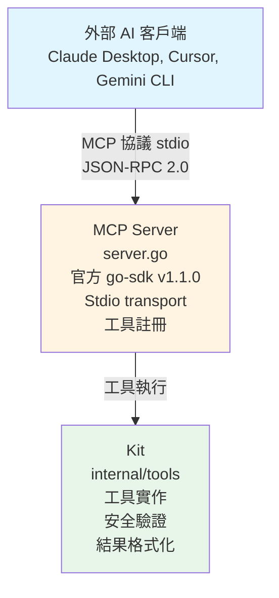

# MCP Server 套件

Model Context Protocol (MCP) 伺服器實作，將 Koopa 的工具暴露給外部 AI 客戶端。

[English](./README.md)

---

## 設計理念

MCP Server 套件遵循 Koopa 綜合策略中的**直接整合原則**：

### 核心原則：直接內聯處理

**無轉換層** - MCP 回應直接在工具處理器中構建，遵循 Go 標準庫模式如 `net/http.Handler`。

**為什麼不要轉換層？**

**拒絕的模式**：
- `adaptResult()` - 創建不必要的抽象
- `toResponse()` - 增加複雜性但無價值
- `NewToolResult()` - 不符合 Go 慣例

**Go 標準庫方法**：
```
net/http.Handler → 直接在處理器中構建回應
database/sql.Scan → 在使用點直接轉換
encoding/json → 直接序列化，無中間層
```

**我們的方法**：
```
MCP Tool Handler → 直接構建 MCP 回應
                → 無中間轉換函數
                → 像 net/http 一樣內聯處理
```

**優點**：
- **簡單性**：少一層需要理解和維護
- **靈活性**：每個工具可以自定義回應格式
- **Go 慣用**：遵循標準庫慣例
- **效能**：無不必要的資料轉換

---

## 架構



---

## 組件

### Server

主要 MCP 伺服器：
1. 封裝官方 MCP SDK 伺服器
2. 持有 Kit 實例以執行工具
3. 將工具註冊到 MCP 協議
4. 處理 stdio transport 通訊

### Config

伺服器配置結構：
- **Name**：伺服器名稱（例如 "koopa"）
- **Version**：伺服器版本字串
- **KitConfig**：工具套件依賴（見 internal/tools）

### Transport

使用 **stdio transport**（MCP 標準）：
- **stdin**：從客戶端接收 JSON-RPC 請求
- **stdout**：向客戶端發送 JSON-RPC 回應
- **stderr**：日誌（客戶端不可見）

---

## MCP 協議

### JSON-RPC 2.0

所有通訊使用 JSON-RPC 2.0 格式：

**請求**：
```json
{
  "jsonrpc": "2.0",
  "id": 1,
  "method": "tools/call",
  "params": {
    "name": "readFile",
    "arguments": {"path": "README.md"}
  }
}
```

**回應**：
```json
{
  "jsonrpc": "2.0",
  "id": 1,
  "result": {
    "content": [{"text": "檔案內容..."}],
    "isError": false
  }
}
```

### 協議生命週期

1. **初始化**：客戶端發送 initialize 請求
2. **能力**：伺服器回應能力（工具、日誌等）
3. **工具調用**：客戶端通過 tools/call 方法調用工具
4. **回應**：伺服器通過 CallToolResult 返回結果
5. **關閉**：客戶端關閉 stdin 以終止伺服器

---

## 工具註冊

### 直接內聯模式

每個工具使用處理器註冊：
1. 從 MCP 請求提取輸入
2. 調用 Kit 方法
3. **直接內聯**構建 MCP 回應

**範例**：readFile 工具註冊

```
registerReadFile():
  1. 定義輸入 schema（ReadFileInput struct）
  2. 從 struct 生成 JSON schema
  3. 註冊工具處理器：
     - 從輸入提取 path
     - 調用 kit.ReadFile()
     - 內聯處理 Result：
       * 如果錯誤 → 構建錯誤回應
       * 如果成功 → 構建成功回應
     - 無轉換函數
```

### 錯誤處理

**Agent Errors**（來自 Kit Result）：
- 狀態：StatusError
- 返回：CallToolResult{IsError: true, Content: 錯誤文字}
- 客戶端看到錯誤並可以重試/調整

**System Errors**（Go error）：
- 返回：nil, nil, error
- MCP SDK 處理錯誤
- 客戶端看到系統故障

---

## 安全

### 輸入驗證

所有輸入通過 Kit 的安全驗證器驗證：
- **Path**：防止路徑穿越
- **Command**：阻擋危險命令
- **URL**：SSRF 防護
- **Env**：過濾敏感變數

### Transport 安全

- **僅 Stdio**：無網路暴露
- **本地進程**：客戶端和伺服器在同一信任邊界
- **無身份驗證**：依賴作業系統級進程隔離

### 日誌

- **stdout**：僅保留給 JSON-RPC
- **stderr**：所有應用程式日誌
- **無機密**：日誌過濾敏感資料

---

## 整合

### Claude Desktop

配置在 `~/Library/Application Support/Claude/claude_desktop_config.json`：

```json
{
  "mcpServers": {
    "koopa": {
      "command": "/path/to/koopa",
      "args": ["mcp"],
      "env": {
        "GEMINI_API_KEY": "your-key",
        "DATABASE_URL": "your-db"
      }
    }
  }
}
```

### Cursor IDE

在 Cursor 設定中類似配置。

### Gemini CLI

可通過 stdio pipe 整合。

---

## CLI 命令

啟動 MCP 伺服器：

```bash
koopa mcp
```

**執行內容**：
1. 初始化應用程式（資料庫、知識庫等）
2. 創建帶安全驗證器的 Kit
3. 創建 MCP Server
4. 註冊工具
5. 啟動 stdio transport（阻塞直到 stdin 關閉）
6. 處理 SIGINT/SIGTERM 的優雅關閉

---

## 設計決策

### 為什麼使用官方 SDK？

**考慮的替代方案**：手動實作 MCP 協議
**決策**：使用官方 go-sdk v1.1.0
**理由**：
- 由 MCP 團隊維護
- 協議合規性保證
- 處理底層細節（framing、JSON-RPC 等）
- 規格變更的定期更新

### 為什麼使用 Stdio Transport？

**考慮的替代方案**：HTTP transport、WebSocket
**決策**：使用 stdio transport
**理由**：
- MCP 伺服器標準
- 簡單的進程模型（啟動/停止）
- 無端口衝突
- 與所有 MCP 客戶端相容（Claude Desktop、Cursor 等）

### 為什麼直接內聯處理？

**考慮的替代方案**：創建轉換層（adaptResult、toResponse 等）
**決策**：直接在處理器中構建回應
**理由**：
- 遵循 Go stdlib 模式（net/http、database/sql）
- 更簡單的程式碼庫（少一層）
- 更靈活（每個工具可以自定義）
- 更易理解（無需在函數間跳轉）

### 為什麼整合 Kit？

**考慮的替代方案**：直接在 MCP 套件中實作工具
**決策**：使用 internal/tools 的現有 Kit
**理由**：
- 重用工具實作（DRY 原則）
- 共享安全驗證器
- Genkit flows 和 MCP 間的一致行為
- 工具邏輯的單一事實來源

---

## 測試

### 單元測試
測試驗證：
- 伺服器創建和配置
- 工具註冊
- 輸入 schema 生成
- 配置驗證

### 整合測試
端到端測試驗證：
- Claude Desktop 整合
- 通過 MCP 協議調用工具
- 回應格式正確性

### 覆蓋率
目前測試覆蓋率：**47.4%**

改進目標區域：
- 更多工具註冊測試
- 協議錯誤處理測試
- Stdio transport 邊界案例

---

## 已知限制

### 單一工具實作

目前僅 `readFile` 完全整合。Kit 中註冊的其他工具：
- 在 Genkit flows 中可用
- 尚未在 MCP 伺服器中註冊

**計劃**：在未來迭代中逐步添加工具註冊。

### 協議版本

- **客戶端（Claude Desktop）**：2025-06-18
- **SDK 預設**：2024-11-05
- **狀態**：版本協商有效，但需監控不相容性

### 效能

Stdio transport 是同步且單執行緒的：
- **優點**：簡單可靠
- **缺點**：無並發請求
- **影響**：IDE 使用案例可接受（序列工具調用）

---

## 未來改進

### 更多工具
註冊剩餘 Kit 工具：
- writeFile、listFiles、deleteFile、getFileInfo
- executeCommand、getEnv、currentTime
- httpGet
- searchHistory、searchDocuments、searchSystemKnowledge

### 日誌
增強日誌選項：
- 可配置日誌級別
- 結構化日誌到檔案
- 除錯用的追蹤 ID

### 資源
MCP 資源支援：
- 暴露 file:// URI
- 範本提示
- 上下文提供者

### 取樣
MCP 取樣支援：
- LLM 完成請求
- 串流回應

---

## 故障排除

### 伺服器無法啟動

**症狀**：`koopa mcp` 立即退出
**原因**：
- 缺少環境變數（GEMINI_API_KEY、DATABASE_URL）
- 資料庫連接失敗
- 工作目錄權限

**修復**：檢查 stderr 日誌的錯誤訊息

### 工具在客戶端不可見

**症狀**：工具已註冊但未在 Claude Desktop 中顯示
**原因**：
- 客戶端快取未刷新
- 協議版本不匹配
- 工具註冊錯誤

**修復**：重啟 Claude Desktop，檢查伺服器日誌

### 日誌破壞協議

**症狀**：客戶端 JSON 解析錯誤
**原因**：
- 日誌寫入 stdout 而非 stderr

**修復**：確保所有日誌使用 stderr（已在 cmd/execute.go 修復）

---

## 相關文檔

- [PHASE2_IMPLEMENTATION_PLAN.md](../../PHASE2_IMPLEMENTATION_PLAN.md)：實施計劃
- [PHASE2-DESIGN-RATIONALE.md](../../PHASE2-DESIGN-RATIONALE.md)：為什麼無轉換層
- [docs/mcp-server-usage.md](../../docs/mcp-server-usage.md)：使用指南
- [internal/tools/README.md](../tools/README.md)：工具實作
- [MCP Specification](https://spec.modelcontextprotocol.io/)：官方協議規格
