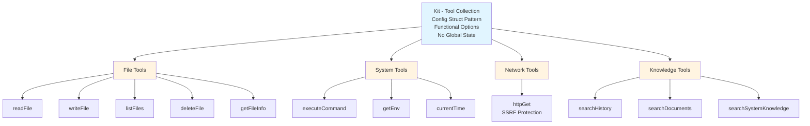

# Tools Package

AI Agent tool collection with V3.0 architecture design.

[繁體中文](./README_ZH_TW.md)

---

## Design Philosophy

The Tools package follows the **V3.0 Design Principles**:

### 1. Config Struct Pattern

All required dependencies are injected via `KitConfig` structure, eliminating global state and improving testability.

**Benefits**:
- **Explicit Dependencies**: All dependencies are visible in one place
- **Testability**: Easy to mock dependencies for testing
- **No Global State**: Thread-safe and predictable behavior

### 2. Functional Options Pattern

Optional features (like logging) are configured via functional options, providing flexibility without cluttering the core API.

**Benefits**:
- **Backward Compatibility**: New options don't break existing code
- **Composability**: Options can be combined freely
- **Clean API**: Required vs optional dependencies are clearly separated

### 3. Structured Result Type

All tools return a standardized `Result` structure with status, data, and error information.

**Structure**:
- `Status`: Execution status (success/error/partial)
- `Message`: Human-readable description
- `Data`: Tool-specific output data
- `Error`: Structured error information (code, message, details)

**Benefits**:
- **Consistent Interface**: All tools follow the same pattern
- **Rich Error Context**: Structured errors provide detailed debugging information
- **LLM-Friendly**: Clear status and messages help AI understand outcomes

### 4. Agent Error vs System Error Semantics

Clear distinction between recoverable and unrecoverable errors:

**Agent Error** (Business Logic Error):
- Examples: File not found, permission denied, validation failed
- Return: `Result{Status: StatusError, Error: ...}, nil`
- LLM can see the error and decide how to handle it (retry, different approach, etc.)

**System Error** (System Failure):
- Examples: Database connection lost, out of memory, disk failure
- Return: `Result{}, error`
- Genkit catches and interrupts the flow (requires human intervention)

### 5. No Tool List Maintenance

Tools are managed entirely by Genkit's internal registry. The Kit uses `genkit.ListTools()` to enumerate registered tools, eliminating manual list maintenance.

**Benefits**:
- **Single Source of Truth**: Genkit manages the tool registry
- **No Sync Issues**: Can't forget to update a list when adding/removing tools
- **Dynamic Discovery**: Tools can be registered at runtime

---

## Architecture



---

## Components

### KitConfig

Configuration structure holding all required dependencies:

- **PathVal**: Path security validator (prevents path traversal attacks)
- **CmdVal**: Command security validator (blocks dangerous commands)
- **EnvVal**: Environment variable security validator (filters sensitive vars)
- **HTTPVal**: HTTP security validator (SSRF protection, size limits)
- **KnowledgeStore**: Knowledge search interface (semantic search)

### Kit

The main tool collection that:
1. Holds validated dependencies via KitConfig
2. Implements all tool methods
3. Registers tools to Genkit
4. Provides tool enumeration via `All()`

### Result Type

Standardized return structure:
- **Status**: success | error | partial
- **Message**: Human-readable description
- **Data**: Tool-specific output (flexible structure)
- **Error**: Structured error (code + message + details)

### Error Codes

Standardized error codes:
- `SecurityError`: Security validation failed
- `NotFound`: Resource not found
- `PermissionDenied`: Access denied
- `IOError`: I/O operation failed
- `ExecutionError`: Command execution failed
- `TimeoutError`: Operation timed out
- `NetworkError`: Network request failed
- `ValidationError`: Input validation failed

---

## Tool Categories

### File Operations
- **readFile**: Read complete file content with security validation
- **writeFile**: Create or overwrite files with secure permissions
- **listFiles**: List directory contents with metadata
- **deleteFile**: Permanently delete files (with validation)
- **getFileInfo**: Get file metadata without reading content

### System Operations
- **executeCommand**: Execute shell commands with security checks (dangerous commands blocked)
- **getEnv**: Read environment variables (sensitive vars filtered)
- **currentTime**: Get current system time

### Network Operations
- **httpGet**: HTTP GET request with comprehensive security:
  - SSRF protection (blocks internal IPs, localhost, metadata services)
  - Response size limits
  - Timeout protection

### Knowledge Operations
- **searchHistory**: Semantic search in conversation history
- **searchDocuments**: Semantic search in indexed documents
- **searchSystemKnowledge**: Search system knowledge base (FAQs, best practices)

---

## Security Features

### Path Validation
- Prevents path traversal attacks (`../../../etc/passwd`)
- Enforces allowed directory restrictions
- Normalizes paths before validation

### Command Validation
- Blocks dangerous commands: `rm -rf`, `dd`, `format`, `sudo`, etc.
- Validates command executables
- Prevents command injection

### Environment Variable Filtering
- Blocks sensitive variables: API keys, passwords, tokens
- Prevents information leakage

### HTTP Security
- **SSRF Protection**: Blocks requests to internal IPs, localhost, cloud metadata services
- **Size Limits**: Prevents memory exhaustion from large responses
- **Timeout Protection**: Prevents hanging requests

---

## Design Decisions

### Why Config Struct Pattern?

**Alternative Considered**: Passing individual parameters
**Decision**: Use Config Struct Pattern
**Rationale**:
- Scales better with growing dependencies
- Self-documenting (field names describe purpose)
- IDE autocomplete support
- Easy to add new dependencies without breaking API

### Why Structured Result?

**Alternative Considered**: Return raw data or error strings
**Decision**: Use structured Result type
**Rationale**:
- Provides rich context for debugging
- LLM can understand success/failure semantics
- Standardized error codes enable programmatic handling
- Consistent interface across all tools

### Why Agent Error vs System Error?

**Alternative Considered**: All errors as Go errors
**Decision**: Distinguish Agent Errors (returned in Result) from System Errors (Go error)
**Rationale**:
- Agent Errors are expected and recoverable (LLM can retry, adjust approach)
- System Errors require human intervention (infrastructure issues)
- Genkit can handle each type appropriately

### Why No Tool List?

**Alternative Considered**: Maintain global or local tool list
**Decision**: Use Genkit's `ListTools()` API
**Rationale**:
- Genkit already maintains the registry
- No risk of list getting out of sync
- Adheres to DRY (Don't Repeat Yourself) principle
- Simplifies code maintenance

---

## Usage Guidelines

### Creating a Kit

```go
// 1. Create security validators
pathVal, _ := security.NewPath([]string{"."})
cmdVal := security.NewCommand()
envVal := security.NewEnv()
httpVal := security.NewHTTP()

// 2. Create KitConfig
cfg := tools.KitConfig{
    PathVal:        pathVal,
    CmdVal:         cmdVal,
    EnvVal:         envVal,
    HTTPVal:        httpVal,
    KnowledgeStore: knowledgeStore,
}

// 3. Create Kit (with optional logger)
kit, err := tools.NewKit(cfg, tools.WithLogger(logger))
```

### Registering Tools

```go
// Register all tools to Genkit
if err := kit.Register(g); err != nil {
    log.Fatal(err)
}
```

### Using Tools

Tools are called by Genkit automatically based on LLM decisions. The Kit handles:
- Input validation
- Security checks
- Error handling
- Result formatting

---

## Testing

### Unit Testing
Each tool method has comprehensive unit tests covering:
- Success cases
- Error cases (file not found, permission denied, etc.)
- Security validation (path traversal, command injection)
- Edge cases (empty input, large files, etc.)

### Integration Testing
Tests verify:
- Tool registration with Genkit
- End-to-end tool invocation
- Result serialization/deserialization

### Coverage
Current test coverage: **83.8%**

---

## Future Enhancements

Potential improvements:
- Additional file operations (copyFile, moveFile)
- More network operations (HTTP POST, WebSocket)
- Database operations (query, insert, update)
- Container operations (docker, kubernetes)

---

## Related Documentation

- [PHASE1_IMPLEMENTATION_PLAN.md](../../PHASE1_IMPLEMENTATION_PLAN.md): Implementation plan
- [PHASE2-DESIGN-RATIONALE.md](../../PHASE2-DESIGN-RATIONALE.md): Design rationale for V3.0
- [internal/mcp/README.md](../mcp/README.md): MCP Server integration
