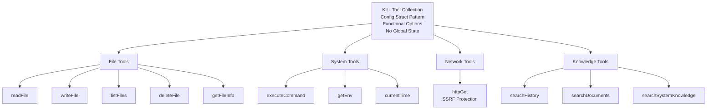

# Tools Package

Secure AI agent toolkit with structured error handling and zero-global-state design.

[繁體中文](./README_ZH_TW.md)

---

## Design Philosophy

The Tools building maintainable, testable, and LLM-friendly agent tools.

### Core Principles

**1. Config Struct Pattern**
All dependencies injected via `KitConfig` structure—no global state, explicit dependencies, testable by design.

**2. Functional Options Pattern**
Optional features (logging, metrics) configured through functional options, preserving backward compatibility.

**3. Structured Results**
Standardized `Result{Status, Data, Error}` format enables consistent LLM interaction and rich error context.

**4. Error Semantics: Agent vs System**
- **Agent Errors**: Recoverable failures (file not found, permission denied) returned in `Result` → LLM can retry
- **System Errors**: Infrastructure failures (database down, OOM) returned as Go `error` → requires human intervention

**5. Zero Maintenance Tool Registry**
Leverages `genkit.ListTools()` API—single source of truth, no manual list synchronization.

---

## Architecture

**12 tools across 4 categories**: File (5) • System (3) • Network (1) • Knowledge (3)

---

## Design Decisions

### Why Structured Result over Raw Returns?

**Problem**: Inconsistent error handling across tools makes LLM interaction unpredictable.

**Solution**: Standardized `Result` type with status, data, and structured errors.

**Benefits**:
- LLM can parse status semantically
- Rich debugging context through error codes
- Consistent interface across all tools
- Enables programmatic error handling

### Why Distinguish Agent Error from System Error?

**Problem**: Treating all errors equally prevents LLM from recovering gracefully.

**Solution**: Agent errors in `Result` (LLM-visible), system errors as Go `error` (human-visible).

**Benefits**:
- LLM can retry on agent errors (wrong path, missing permission)
- System errors halt execution (database failure requires ops intervention)
- Genkit framework handles each type appropriately

### Why Zero Tool List Maintenance?

**Problem**: Manual tool lists drift out of sync with registrations, causing runtime failures.

**Solution**: Use Genkit's `ListTools()` API as single source of truth.

**Benefits**:
- DRY principle—register once, enumerate anywhere
- No sync bugs when adding/removing tools
- Runtime tool discovery support

---

## Security Model

All tools enforce **defense-in-depth** validation:

- **Path Validation**: Prevents traversal attacks, enforces allow-list directories, resolves symlinks
- **Command Validation**: Blocks dangerous commands (`rm -rf`, `dd`, `format`, `sudo`, ...)
- **Environment Filtering**: Blocks sensitive variables (API keys, passwords, tokens)
- **HTTP Protection**: SSRF defense (blocks internal IPs, localhost, metadata services), size limits, timeouts

**Security Philosophy**: Fail closed—deny by default, allow explicitly validated operations only.

---

## Design Influences

### Genkit Framework

**Source**: [Firebase Genkit](https://github.com/firebase/genkit) - Google's AI framework for building production-ready AI agents

**Design Philosophy**:
- **Tool-centric**: AI agents invoke tools to interact with the world
- **Registry pattern**: Central tool registry (`ListTools()`, `LookupTool()`) eliminates manual list maintenance
- **Structured I/O**: Typed inputs/outputs with JSON schema validation
- **Framework-managed lifecycle**: Genkit handles tool registration, discovery, and invocation

**Why we adopted it**:
- Zero boilerplate—register once, use anywhere
- Type-safe tool definitions with schema validation
- Built-in observability and tracing
- Production-ready error handling
