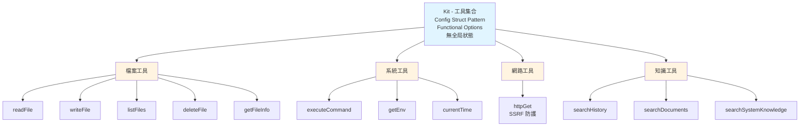

# Tools 套件

基於 V3.0 架構設計的 AI Agent 工具集合。

[English](./README.md)

---

## 設計理念

Tools 套件遵循 **V3.0 設計原則**：

### 1. Config Struct Pattern（配置結構模式）

所有必須的依賴通過 `KitConfig` 結構注入，消除全局狀態並提高可測試性。

**優點**：
- **明確依賴**：所有依賴在一個地方可見
- **可測試性**：輕鬆 mock 依賴進行測試
- **無全局狀態**：執行緒安全且行為可預測

### 2. Functional Options Pattern（函數選項模式）

可選功能（如日誌）通過函數選項配置，在不影響核心 API 的情況下提供靈活性。

**優點**：
- **向後兼容**：新選項不會破壞現有代碼
- **可組合性**：選項可以自由組合
- **清晰 API**：必須依賴和可選依賴清楚分離

### 3. 結構化 Result 類型

所有工具返回標準化的 `Result` 結構，包含狀態、數據和錯誤信息。

**結構**：
- `Status`：執行狀態（success/error/partial）
- `Message`：人類可讀的描述
- `Data`：工具特定的輸出數據
- `Error`：結構化錯誤信息（代碼、訊息、詳情）

**優點**：
- **一致介面**：所有工具遵循相同模式
- **豐富錯誤上下文**：結構化錯誤提供詳細除錯信息
- **LLM 友好**：清晰的狀態和訊息幫助 AI 理解結果

### 4. Agent Error vs System Error 語意

明確區分可恢復和不可恢復的錯誤：

**Agent Error**（業務邏輯錯誤）：
- 範例：檔案不存在、權限拒絕、驗證失敗
- 返回：`Result{Status: StatusError, Error: ...}, nil`
- LLM 可以看到錯誤並決定如何處理（重試、不同方法等）

**System Error**（系統故障）：
- 範例：資料庫連接中斷、記憶體不足、磁碟故障
- 返回：`Result{}, error`
- Genkit 捕獲並中斷流程（需要人工介入）

### 5. 無工具列表維護

工具完全由 Genkit 的內部註冊表管理。Kit 使用 `genkit.ListTools()` 枚舉已註冊的工具，消除手動列表維護。

**優點**：
- **單一事實來源**：Genkit 管理工具註冊表
- **無同步問題**：添加/刪除工具時不會忘記更新列表
- **動態發現**：工具可以在執行時註冊

---

## 架構



---

## 組件

### KitConfig

配置結構，持有所有必須的依賴：

- **PathVal**：路徑安全驗證器（防止路徑穿越攻擊）
- **CmdVal**：命令安全驗證器（阻擋危險命令）
- **EnvVal**：環境變數安全驗證器（過濾敏感變數）
- **HTTPVal**：HTTP 安全驗證器（SSRF 防護、大小限制）
- **KnowledgeStore**：知識搜索介面（語意搜索）

### Kit

主要工具集合：
1. 通過 KitConfig 持有已驗證的依賴
2. 實作所有工具方法
3. 將工具註冊到 Genkit
4. 通過 `All()` 提供工具枚舉

### Result 類型

標準化返回結構：
- **Status**：success | error | partial
- **Message**：人類可讀描述
- **Data**：工具特定輸出（靈活結構）
- **Error**：結構化錯誤（代碼 + 訊息 + 詳情）

### 錯誤代碼

標準化錯誤代碼：
- `SecurityError`：安全驗證失敗
- `NotFound`：資源不存在
- `PermissionDenied`：存取拒絕
- `IOError`：I/O 操作失敗
- `ExecutionError`：命令執行失敗
- `TimeoutError`：操作逾時
- `NetworkError`：網路請求失敗
- `ValidationError`：輸入驗證失敗

---

## 工具分類

### 檔案操作
- **readFile**：讀取完整檔案內容（含安全驗證）
- **writeFile**：建立或覆寫檔案（安全權限）
- **listFiles**：列出目錄內容（含元數據）
- **deleteFile**：永久刪除檔案（含驗證）
- **getFileInfo**：獲取檔案元數據（不讀取內容）

### 系統操作
- **executeCommand**：執行 shell 命令（含安全檢查，危險命令被阻擋）
- **getEnv**：讀取環境變數（敏感變數被過濾）
- **currentTime**：獲取當前系統時間

### 網路操作
- **httpGet**：HTTP GET 請求（全面安全防護）：
  - SSRF 防護（阻擋內部 IP、localhost、元數據服務）
  - 回應大小限制
  - 逾時保護

### 知識操作
- **searchHistory**：對話歷史的語意搜索
- **searchDocuments**：已索引文檔的語意搜索
- **searchSystemKnowledge**：搜索系統知識庫（FAQ、最佳實踐）

---

## 安全功能

### 路徑驗證
- 防止路徑穿越攻擊（`../../../etc/passwd`）
- 強制執行允許目錄限制
- 驗證前標準化路徑

### 命令驗證
- 阻擋危險命令：`rm -rf`、`dd`、`format`、`sudo` 等
- 驗證命令可執行檔
- 防止命令注入

### 環境變數過濾
- 阻擋敏感變數：API 金鑰、密碼、令牌
- 防止資訊洩漏

### HTTP 安全
- **SSRF 防護**：阻擋對內部 IP、localhost、雲端元數據服務的請求
- **大小限制**：防止大型回應造成記憶體耗盡
- **逾時保護**：防止請求掛起

---

## 設計決策

### 為什麼使用 Config Struct Pattern？

**考慮的替代方案**：傳遞個別參數
**決策**：使用 Config Struct Pattern
**理由**：
- 隨著依賴增長擴展性更好
- 自文檔化（欄位名稱描述用途）
- IDE 自動完成支援
- 易於添加新依賴而不破壞 API

### 為什麼使用結構化 Result？

**考慮的替代方案**：返回原始資料或錯誤字串
**決策**：使用結構化 Result 類型
**理由**：
- 為除錯提供豐富上下文
- LLM 可以理解成功/失敗語意
- 標準化錯誤代碼支援程式化處理
- 所有工具的一致介面

### 為什麼區分 Agent Error 和 System Error？

**考慮的替代方案**：所有錯誤作為 Go error
**決策**：區分 Agent Error（在 Result 中返回）和 System Error（Go error）
**理由**：
- Agent Error 是預期且可恢復的（LLM 可以重試、調整方法）
- System Error 需要人工介入（基礎設施問題）
- Genkit 可以適當處理每種類型

### 為什麼不維護工具列表？

**考慮的替代方案**：維護全局或局部工具列表
**決策**：使用 Genkit 的 `ListTools()` API
**理由**：
- Genkit 已經維護註冊表
- 無列表不同步風險
- 遵循 DRY（Don't Repeat Yourself）原則
- 簡化代碼維護

---

## 使用指南

### 建立 Kit

```go
// 1. 建立安全驗證器
pathVal, _ := security.NewPath([]string{"."})
cmdVal := security.NewCommand()
envVal := security.NewEnv()
httpVal := security.NewHTTP()

// 2. 建立 KitConfig
cfg := tools.KitConfig{
    PathVal:        pathVal,
    CmdVal:         cmdVal,
    EnvVal:         envVal,
    HTTPVal:        httpVal,
    KnowledgeStore: knowledgeStore,
}

// 3. 建立 Kit（含可選的 logger）
kit, err := tools.NewKit(cfg, tools.WithLogger(logger))
```

### 註冊工具

```go
// 將所有工具註冊到 Genkit
if err := kit.Register(g); err != nil {
    log.Fatal(err)
}
```

### 使用工具

工具由 Genkit 根據 LLM 決策自動調用。Kit 處理：
- 輸入驗證
- 安全檢查
- 錯誤處理
- 結果格式化

---

## 測試

### 單元測試
每個工具方法都有全面的單元測試，涵蓋：
- 成功案例
- 錯誤案例（檔案不存在、權限拒絕等）
- 安全驗證（路徑穿越、命令注入）
- 邊界案例（空輸入、大檔案等）

### 整合測試
測試驗證：
- 與 Genkit 的工具註冊
- 端到端工具調用
- 結果序列化/反序列化

### 覆蓋率
目前測試覆蓋率：**83.8%**

---

## 未來改進

潛在改進：
- 額外檔案操作（copyFile、moveFile）
- 更多網路操作（HTTP POST、WebSocket）
- 資料庫操作（query、insert、update）
- 容器操作（docker、kubernetes）

---

## 相關文檔

- [PHASE1_IMPLEMENTATION_PLAN.md](../../PHASE1_IMPLEMENTATION_PLAN.md)：實施計劃
- [PHASE2-DESIGN-RATIONALE.md](../../PHASE2-DESIGN-RATIONALE.md)：V3.0 設計理念
- [internal/mcp/README.md](../mcp/README.md)：MCP Server 整合
