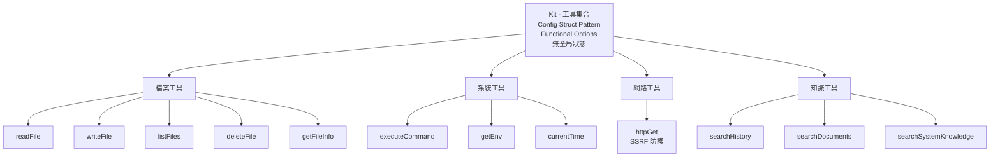

# Tools 套件

具備結構化錯誤處理和零全局狀態設計的安全 AI 代理工具包。

[English](./README.md)

---

## 設計理念

Tools 用於構建可維護、可測試、LLM 友好的代理工具。

### 核心原則

**1. Config Struct Pattern**
所有依賴通過 `KitConfig` 結構注入—無全局狀態、明確依賴、設計即可測試。

**2. Functional Options Pattern**
可選功能（日誌、指標）通過函數選項配置，保持向後兼容性。

**3. 結構化結果**
標準化的 `Result{Status, Message, Data, Error}` 格式實現一致的 LLM 互動和豐富的錯誤上下文。

**4. 錯誤語意：Agent vs System**
- **Agent Errors**：可恢復故障（檔案不存在、權限拒絕）在 `Result` 中返回 → LLM 可重試
- **System Errors**：基礎設施故障（資料庫停機、記憶體不足）作為 Go `error` 返回 → 需人工介入

**5. 零維護工具註冊表**
利用 `genkit.ListTools()` API—單一事實來源，無需手動列表同步。

---

## 架構

**4 大類別 12 個工具**：檔案（5）• 系統（3）• 網路（1）• 知識（3）

---

### 為什麼用結構化 Result 而非原始返回值？

**問題**：工具間不一致的錯誤處理使 LLM 互動不可預測。

**解決方案**：標準化的 `Result` 類型包含狀態、訊息、數據和結構化錯誤。

**優點**：
- LLM 可語意化解析狀態
- 通過錯誤代碼提供豐富除錯上下文
- 所有工具間一致的介面
- 支援程式化錯誤處理

### 為什麼區分 Agent Error 和 System Error？

**問題**：平等對待所有錯誤阻止 LLM 優雅恢復。

**解決方案**：Agent 錯誤放在 `Result` 中（LLM 可見），系統錯誤作為 Go `error`（人類可見）。

**優點**：
- LLM 可在 agent 錯誤時重試（錯誤路徑、缺少權限）
- 系統錯誤停止執行（資料庫故障需運維介入）
- Genkit 框架適當處理每種類型

### 為什麼零工具列表維護？

**問題**：手動工具列表與註冊不同步，導致執行時故障。

**解決方案**：使用 Genkit 的 `ListTools()` API 作為單一事實來源。

**優點**：
- DRY 原則—註冊一次，隨處枚舉
- 添加/刪除工具時無同步錯誤
- 支援執行時工具發現

---

## 安全模型

所有工具強制執行**縱深防禦**驗證：

- **路徑驗證**：防止穿越攻擊、強制允許列表目錄、解析符號連結
- **命令驗證**：阻擋危險命令（`rm -rf`、`dd`、`format`、`sudo`、...）
- **環境變數過濾**：阻擋敏感變數（API 金鑰、密碼、令牌）
- **HTTP 防護**：SSRF 防禦（阻擋內部 IP、localhost、元數據服務）、大小限制、逾時

**安全理念**：預設關閉—預設拒絕，僅允許明確驗證的操作。

---

## 設計影響

### Genkit 框架

**來源**：[Firebase Genkit](https://github.com/firebase/genkit) - Google 的 AI 框架，用於構建生產級 AI 代理

**設計理念**：
- **以工具為中心**：AI 代理通過調用工具與世界互動
- **註冊表模式**：中央工具註冊表（`ListTools()`、`LookupTool()`）消除手動列表維護
- **結構化 I/O**：帶 JSON schema 驗證的類型化輸入/輸出
- **框架管理生命週期**：Genkit 處理工具註冊、發現和調用

**為什麼採用它**：
- 零樣板代碼—註冊一次，隨處使用
- 帶 schema 驗證的類型安全工具定義
- 內建可觀察性和追蹤
- 生產就緒的錯誤處理
